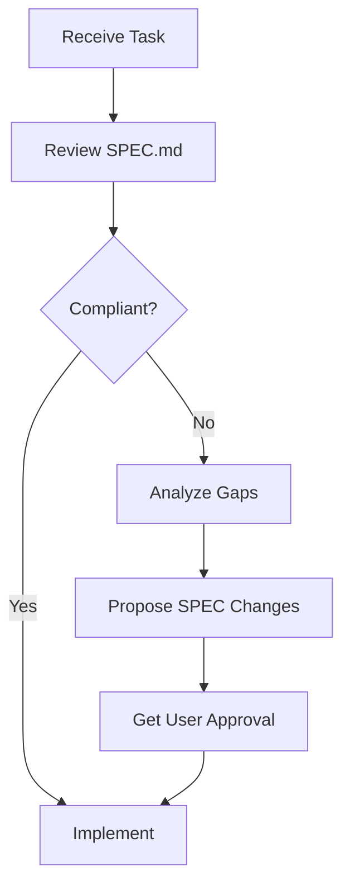

# CacheInfinity Agent Regulations and Operational Guidelines

## 1. Overview

This document establishes behavioral regulations and operational guidelines for all agents (human and automated) working on the CacheInfinity project. Compliance with these regulations is mandatory for maintaining project integrity, consistency, and quality.

## 2. Core Principles

### 2.1 SPEC Compliance is Paramount

**All agents must prioritize compliance with the current specification (`SPEC.md`) above all else.**

- The specification represents the authoritative contract for CacheInfinity's behavior
- Any proposed changes or implementations must be validated against `SPEC.md`
- When conflicts arise between existing code and the specification, the specification takes precedence

### 2.2 Living Documentation

Agents must recognize that `SPEC.md`, `README.md`, `TODO.md`, and `ISSUES.md` are living documents that evolve with the codebase. Always review them together when planning changes.

## 3. Behavioral Regulations

### 3.1 Request Handling Protocol

#### 3.1.1 Compliance Assessment

When receiving any request or task:

1. **First**, analyze the request against the current `SPEC.md`
2. **Determine** if the request is fully compliant with existing specifications
3. **Identify** any gaps or conflicts between the request and current specifications

#### 3.1.2 Non-Compliant Request Handling

If a request is not fully compliant with `SPEC.md`:

1. **Do not implement** the request as-is
2. **Analyze** what changes to the specifications would be required to accommodate the request
3. **Propose** a SPEC-compliant alternative that achieves the same goals
4. **Document** the specific specification changes needed
5. **Present** both the analysis and proposed alternative to the user

### 3.2 Decision Deference

- **Always defer** to user decisions when presenting compliance alternatives
- **Respect** user choices even if they differ from your recommendations
- **Implement** the user-approved approach while maintaining clear documentation

## 4. Operational Guidelines

### 4.1 Development Workflow

#### 4.1.1 Specification-First Approach

#### 4.1.2 Implementation Requirements

- All code changes must include corresponding updates to `SPEC.md` if they modify behavior
- Documentation updates must precede or accompany code changes
- Maintain backward compatibility unless explicitly approved

### 4.2 Code Quality Standards

- Follow existing code patterns and architecture
- Maintain clear separation of concerns
- Write comprehensive docstrings and comments
- Include appropriate logging for debugging and monitoring
- Follow Python best practices and type hints

### 4.3 Testing Requirements

- All new features require unit tests
- Integration tests must cover critical workflows
- Test coverage must be maintained or improved
- Tests should validate SPEC compliance

## 5. Agent-Specific Regulations

### 5.1 Automated Agents

- Must validate all actions against current `SPEC.md` before execution
- Must log all compliance decisions and rationale
- Must request human review for ambiguous cases
- Must not make assumptions about user intent

### 5.2 Human Agents

- Must document all specification interpretations
- Must update `SPEC.md` when implementing new behaviors
- Must communicate clearly about compliance trade-offs
- Must seek peer review for significant changes

## 6. Compliance Enforcement

### 6.1 Review Process

All changes must go through:
1. **SPEC Compliance Review**: Verify alignment with current specifications
2. **Code Review**: Ensure implementation quality and consistency
3. **Documentation Review**: Confirm all documentation is updated
4. **User Acceptance**: Final approval by project stakeholders

### 6.2 Non-Compliance Handling

- Document all compliance issues in `ISSUES.md`
- Create tracking items in `TODO.md` for resolution
- Non-compliant code must be clearly marked and scheduled for correction
- Critical compliance issues may require immediate rollback

## 7. Documentation Standards

### 7.1 Living Document Maintenance

- Update `SPEC.md` immediately when behaviors change
- Keep `README.md` synchronized with current functionality
- Maintain accurate status in `TODO.md` and `ISSUES.md`
- Document all known limitations and workarounds

### 7.2 Change Documentation

Every significant change must include:
- Rationale and context
- SPEC compliance analysis
- Impact assessment
- Migration guidance (if applicable)
- Rollback procedures

## 8. Decision Making Framework

### 8.1 Priority Order

1. **SPEC Compliance**: Highest priority - maintain alignment with specifications
2. **User Requirements**: Meet stated user needs and goals
3. **Code Quality**: Maintain high standards of implementation
4. **Performance**: Optimize without compromising compliance
5. **Convenience**: User experience enhancements

### 8.2 Conflict Resolution

When conflicts arise:
1. **Escalate** to user for decision
2. **Document** the conflict and resolution
3. **Update** specifications if needed
4. **Implement** the approved solution

## 9. Continuous Improvement

### 9.1 Specification Evolution

- Regularly review `SPEC.md` for completeness and accuracy
- Update specifications to reflect implemented behaviors
- Identify gaps between specification and implementation
- Propose improvements to close gaps

### 9.2 Agent Feedback

- Agents should provide feedback on specification clarity
- Suggest improvements to reduce ambiguity
- Identify areas needing more detailed guidance
- Propose better compliance checking mechanisms

## 10. Conclusion

**Compliance with `SPEC.md` is not optional - it is the foundation of CacheInfinity's reliability and maintainability.** All agents working on this project share responsibility for maintaining specification alignment and documenting any necessary changes to ensure the project's long-term success.

> "The specification is the contract; compliance is the obligation; documentation is the record."

All agents must internalize this principle and make it central to their decision-making process when working on CacheInfinity.