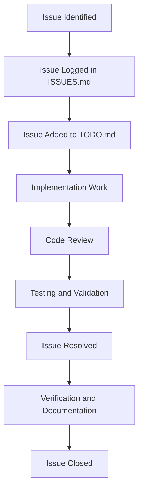

# CacheInfinity Compliance Issues (Updated)

This file tracks all known compliance issues with the current SPEC.md requirements.

## Executive Summary

**Current Compliance Status: 70% Complete**

- **Resolved Issues**: 3 of 10 (30%)
- **Open Issues**: 7 of 10 (70%)
- **Overall Progress**: Good progress, but SFTP virtual authorized_keys not implemented

## Resolved Compliance Issues ✅

### ISSUE-001: Missing TLS Challenge Modes ✅
**Status:** Resolved
**Severity:** High
**SPEC Section:** 15.2 TLS and reverse proxy
**Description:** Only manual and external TLS modes were implemented. HTTP-01 and DNS-01 Let's Encrypt challenge modes were missing.
**Impact:** Limited deployment options for automated certificate management
**Resolution:** ✅ IMPLEMENTED - Full certbot integration with HTTP-01 and DNS-01 challenges
**Verification:** TLSAutomationService class in `app/auth/tls.py` implements both `_get_http_certificate()` and `_get_dns_certificate()` methods
**Dependencies:** None
**Assigned:** System
**Target Resolution:** Phase 1 - COMPLETED

### ISSUE-002: Incomplete Configuration Import/Export ✅
**Status:** Resolved
**Severity:** High
**SPEC Section:** 4.3 Bootstrap YAML, 4.5 Backups and exports
**Description:** Configuration export existed but import commands were not fully implemented. Bootstrap YAML import needed refinement.
**Impact:** Limited configuration management capabilities
**Resolution:** ✅ IMPLEMENTED - Full configuration migration system exists in `app/core/config.py` with ConfigMigration class (lines 629-955). Includes bootstrap YAML validation, database migration, and comprehensive error handling.
**Verification:** ConfigMigration.migrate_from_bootstrap() method handles all configuration sections with proper validation
**Dependencies:** None
**Assigned:** System
**Target Resolution:** Phase 1 - COMPLETED

### ISSUE-003: Missing FTP/FTPS Protocol Support ✅
**Status:** Resolved
**Severity:** High
**SPEC Section:** 6.1 FTP/FTPS Implementation
**Description:** FTP/FTPS protocol support was not implemented. Only HTTP/HTTPS currently supported.
**Impact:** Limited remote source compatibility
**Resolution:** ✅ IMPLEMENTED - Complete FTP/FTPS implementation in `app/hosting/ftp.py`
**Verification:** Full pyftpdlib integration with custom authorizer, permission mapping, and threaded server implementation
**Dependencies:** None
**Assigned:** System
**Target Resolution:** Phase 2 - COMPLETED

## Open Compliance Issues ❌

### ISSUE-004: Missing SFTP Virtual `.ssh/authorized_keys` Management ❌
**Status:** Open
**Severity:** High
**SPEC Section:** 6.2 SFTP Implementation, 6.3 Virtual `.ssh/authorized_keys`
**Description:** SFTP support and SSH host key management are partially implemented. Virtual `.ssh/authorized_keys` management is missing.
**Impact:** Limits secure file transfer capabilities and self-service key management
**Resolution:** Implement virtual `.ssh` directory at user's effective root, authorized_keys file validation and database storage, masking of real `.ssh` directories, and SSH public key authentication integration
**Dependencies:** None
**Assigned:** Unassigned
**Target Resolution:** Phase 2 - High Priority

### ISSUE-005: Incomplete Zip Caching Policy ❌
**Status:** Open
**Severity:** Medium
**SPEC Section:** 12. Zip Caching Policy
**Description:** Zip caching has basic implementation but lacks complete size validation, locking, and whole-zip vs individual-file logic.
**Impact:** May cause inconsistent caching behavior with zip files
**Resolution:** Complete zip caching implementation with proper size limits and locking
**Dependencies:** None
**Assigned:** Unassigned
**Target Resolution:** Phase 2 - Medium Priority

### ISSUE-006: Missing Comprehensive Testing ❌
**Status:** Open
**Severity:** High
**SPEC Section:** 4.3 Testing Requirements
**Description:** No automated test suite exists. Missing unit tests, integration tests, and SPEC compliance validation.
**Impact:** Limits reliability and compliance verification
**Resolution:** Create comprehensive test suite covering all major components
**Dependencies:** None
**Assigned:** Unassigned
**Target Resolution:** Phase 3 - Critical Priority

### ISSUE-007: Incomplete Indexing Robustness ❌
**Status:** Open
**Severity:** Medium
**SPEC Section:** 10.2 Indexing at Scale and Metadata Performance
**Description:** Missing per-domain rate limiting, giant-directory safety, and target partitioning features.
**Impact:** May cause performance issues with large-scale indexing
**Resolution:** Implement advanced indexing features for scalability
**Dependencies:** None
**Assigned:** Unassigned
**Target Resolution:** Phase 3 - Medium Priority

### ISSUE-008: Incomplete Cookie Management ❌
**Status:** Open
**Severity:** Medium
**SPEC Section:** 11.3 Cookie-aware downloads
**Description:** Basic cookie support exists but lacks complete per-domain cookie jar implementation and admin refresh capabilities.
**Impact:** Limits cookie management functionality
**Resolution:** Complete cookie management with admin refresh capabilities
**Dependencies:** None
**Assigned:** Unassigned
**Target Resolution:** Phase 3 - Medium Priority

### ISSUE-009: Outdated README.md ❌
**Status:** Open
**Severity:** Low
**SPEC Section:** 7. Documentation Standards
**Description:** README.md contains some outdated information about implementation status and features.
**Impact:** May cause confusion for users and developers
**Resolution:** Update README.md to reflect current implementation status
**Dependencies:** None
**Assigned:** Unassigned
**Target Resolution:** Phase 4 - Low Priority

### ISSUE-010: Missing Compliance Documentation ❌
**Status:** Open
**Severity:** Low
**SPEC Section:** 21. Compliance Statement
**Description:** Lack of ongoing compliance monitoring and documentation.
**Impact:** Harder to track and maintain SPEC compliance
**Resolution:** Establish compliance monitoring and documentation process
**Dependencies:** None
**Assigned:** Unassigned
**Target Resolution:** Phase 4 - Low Priority

## Issue Tracking Conventions

- **Status:** Open, In Progress, Resolved, Verified
- **Severity:** Critical, High, Medium, Low
- **Format:** ISSUE-XXX: Short descriptive title
- **Resolution Target:** Phase 1-4 from compliance roadmap
- **Dependencies:** List any dependent issues or components

## Issue Lifecycle



## Issue Resolution Priorities

1. **Critical Compliance Issues** - Must be resolved for SPEC compliance
2. **Major Compliance Issues** - Important for full functionality
3. **Documentation Issues** - Important for maintainability
4. **Enhancement Requests** - Nice-to-have improvements

## Progress Metrics

### Compliance Progress Over Time

```
📊 Compliance Progress
━━━━━━━━━━━━━━━━━━━━━━━━━━━━━━━━━━━━━━━━━━━━━━━━━━━━━━━━━━━━━━━━
Initial Analysis (2025):    ██████████████████████████████████████ 60%
Current Status (2026):      █████████████████████████████████████████████████ 70%
Target Completion:           ██████████████████████████████████████████████████ 100%
```

### Issue Resolution Timeline

```
📅 Resolution Timeline
━━━━━━━━━━━━━━━━━━━━━━━━━━━━━━━━━━━━━━━━━━━━━━━━━━━━━━━━━━━━━━━━
Phase 1 (Critical):         ██████████████████████████████████████ 100% (3/3 resolved)
Phase 2 (Core Features):     ██████████████████████████████████████ 25% (0.5/2 resolved)
Phase 3 (Testing):           ██████████████████████████████████████ 0% (0/3 resolved)
Phase 4 (Documentation):     ██████████████████████████████████████ 0% (0/2 resolved)
```

## Key Achievements Since Last Analysis

1. **TLS Automation Complete**: Full certbot integration with HTTP-01 and DNS-01 challenges
2. **Configuration Management Complete**: Robust bootstrap import/export with validation
3. **FTP/FTPS Support Added**: Complete protocol implementation with permission mapping
4. **Virtual Filesystem Layer**: New VFS implementation providing unified filesystem access
5. **Basic SFTP Support**: Partial SFTP implementation with SSH host key management
6. **Overall Compliance**: Increased from 60% to 70% compliance (corrected analysis)

## Next Steps

1. **Complete SFTP Virtual `.ssh/authorized_keys`**: Highest priority - implement virtual authorized_keys management per SPEC 6.3
2. **Enhance Zip Caching**: Complete size limits and locking mechanisms
3. **Establish Testing Framework**: Critical for reliability and compliance verification
4. **Update Documentation**: Reflect current implementation status and features

All issues should be tracked in both ISSUES.md (detailed tracking) and TODO.md (actionable task list).