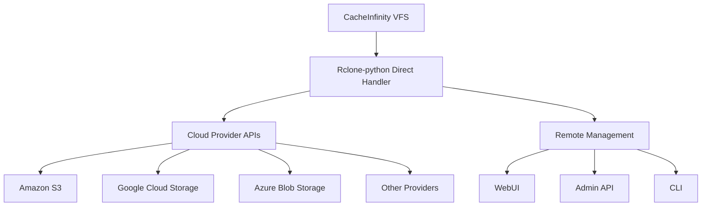

# CacheInfinity Specification (Comprehensive Reformatted Version)

## Table of Contents
1. [Overview](#1-overview)
2. [Architecture](#2-architecture)
   - [2.1 Two-Port Architecture](#21-two-port-architecture)
   - [2.2 Hosting Port Components](#22-hosting-port-components)
   - [2.3 Admin WebUI Port Components](#23-admin-webui-port-components)
   - [2.4 Path Routing Implementation](#24-path-routing-implementation)
3. [Terminology](#3-terminology)
4. [Virtual Filesystem Layer](#4-virtual-filesystem-layer)
   - [4.1 VFS Architecture](#41-vfs-architecture)
   - [4.2 VFS Operations](#42-vfs-operations)
   - [4.3 Service Integration](#43-service-integration)
   - [4.4 VFS and Cachelinks](#44-vfs-and-cachelinks)
5. [Configuration](#5-configuration)
   - [5.1 Configuration Philosophy](#51-configuration-philosophy)
   - [5.2 Database Configuration](#52-database-configuration)
   - [5.3 Bootstrap YAML](#53-bootstrap-yaml)
   - [5.4 Rclone Configuration](#54-rclone-configuration)
   - [5.5 Backups and Exports](#55-backups-and-exports)
   - [5.6 Rclone Remote Link Support](#56-rclone-remote-link-support)
   - [5.7 Logging](#57-logging)
5. [WebDAV Shares](#5-webdav-shares)
   - [5.1 Share Schema](#51-share-schema)
   - [5.2 User Permissions](#52-user-permissions)
   - [5.3 Write-Through Behavior](#53-write-through-behavior)
6. [FTP Family Support](#6-ftp-family-support)
    - [6.1 FTP/FTPS Implementation](#61-ftpftps-implementation)
    - [6.2 SFTP Implementation](#62-sftp-implementation)
    - [6.3 Virtual `.ssh/authorized_keys` management via SFTP](#63-virtual-sshauthorized_keys-management-via-sftp)
    - [6.4 SSH Host Keys](#64-ssh-host-keys)
7. [Users and Authentication](#7-users-and-authentication)
   - [7.1 Authentication Model](#71-authentication-model)
   - [7.2 AuthenticationManager](#72-authenticationmanager)
8. [Mount Trees (Cachelinks)](#8-mount-trees-cachelinks)
   - [8.1 Cachelink Overview](#81-cachelink-overview)
   - [8.2 Path Derivation](#82-path-derivation)
   - [8.3 Archive.org Naming](#83-archiveorg-naming)
   - [8.4 Canonical Cachelink ID](#84-canonical-cachelink-id)
   - [8.5 Cachelink Leaf Schema](#85-cachelink-leaf-schema)
   - [8.6 Database Mirroring](#86-database-mirroring)
   - [8.7 Rclone-python Configuration in Cachelinks WebUI](#87-rclone-python-configuration-in-cachelinks-webui)
9. [Source Behavior](#9-source-behavior)
   - [9.1 URL Normalization](#91-url-normalization)
   - [9.2 Subfolder Modes](#92-subfolder-modes)
   - [9.3 URL Handler Selection](#93-url-handler-selection)
10. [Indexing](#10-indexing)
    - [10.1 Indexing Policy](#101-indexing-policy)
    - [10.2 Indexing Requirements](#102-indexing-requirements)
    - [10.3 Database Requirements](#103-database-requirements)
    - [10.4 Indexing at Scale](#104-indexing-at-scale)
11. [Read-Through Caching](#11-read-through-caching)
    - [11.1 General Read Rules](#111-general-read-rules)
    - [11.2 Avoid-Download Rule](#112-avoid-download-rule)
    - [11.3 Cookie-Aware Downloads](#113-cookie-aware-downloads)
    - [11.4 Robust Downloader Pipeline](#114-robust-downloader-pipeline)
    - [11.5 Fallback and Proxying](#115-fallback-and-proxying)
12. [Zip Caching Policy](#12-zip-caching-policy)
    - [12.1 Size Limits](#121-size-limits)
    - [12.2 One-Zip-at-a-Time Rule](#122-one-zip-at-a-time-rule)
    - [12.3 Whole-Zip Allowed Flow](#123-whole-zip-allowed-flow)
    - [12.4 Individual-File Mode](#124-individual-file-mode)
13. [Availability Probing](#13-availability-probing)
14. [Size vs Size-on-Disk](#14-size-vs-size-on-disk)
15. [Deployment and Repository Layout](#15-deployment-and-repository-layout)
    - [15.1 Repository Structure](#151-repository-structure)
    - [15.2 TLS and Reverse Proxy](#152-tls-and-reverse-proxy)
    - [15.3 Docker Deployment](#153-docker-deployment)
    - [15.4 systemd Deployment](#154-systemd-deployment)
16. [Admin Interfaces](#16-admin-interfaces)
    - [16.1 Admin WebUI](#161-admin-webui)
    - [16.2 Admin API](#162-admin-api)
    - [16.3 Admin CLI](#163-admin-cli)
17. [Error Handling and Observability](#17-error-handling-and-observability)
18. [Security Notes](#18-security-notes)
    - [18.1 Two-Port Security Considerations](#181-two-port-security-considerations)
    - [18.2 General Security Practices](#182-general-security-practices)
19. [Deployment Recommendations](#19-deployment-recommendations)
    - [19.1 Migration Path](#191-migration-path)
    - [19.2 Two-Port Deployment](#192-two-port-deployment)
20. [Glossary](#20-glossary)
21. [Compliance Statement](#21-compliance-statement)

## 1. Overview

CacheInfinity exposes a WebDAV filesystem (consumed by Nextcloud and other DAV clients) where:

* A browsable folder tree is available immediately, even before data exists locally.
* Remote content (Archive.org, Myrient, other HTTP(S)/FTP/FTPS sources) appears as virtual files/folders sourced from a progressive index.
* File bytes are fetched on-demand and cached into datadir storage via a staging-first pipeline.
* Users can also create/modify/delete files; these writes pass through transparently to datadir storage.
* The design prioritizes "no unnecessary downloads": once datadir contains data (or there is no CacheInfinity-managed checksum), it is trusted.

The project is inspired by Infinite Mac's **Infinite Drive** and adapts that experience to WebDAV environments with extra controls for staging volumes, cookie management, and Docker/systemd deployment.

> **Documentation Note:** `SPEC.md`, `README.md`, `TODO.md`, and `ISSUES.md` are **living documents**. They evolve with the codebase and should be treated as the authoritative description of the current design, outstanding work, and known issues. Always review them together when planning changes.

## 2. Architecture

CacheInfinity implements a two-port model with separate hosting and administration interfaces:

### 2.1 Two-Port Architecture

```mermaid
graph TD
    A[Hosting Port] --> B[/dav - WsgiDAV]
    A --> C[/api - Read-only Admin API]
    D[Admin WebUI Port] --> E[Admin WebUI - Write actions]
```

* **Hosting port**: WebDAV + browser interface at `/dav`, read-only admin statistics API at `/api`
* **Admin WebUI port**: Admin WebUI only (write-capable admin actions live here, not on hosting port)

### 2.2 Hosting Port Components

* **Dispatcher:** WSGI DispatcherMiddleware (`app/hosting/dispatcher.py`) that routes requests on the hosting port:
  * `/dav` → WebDAV application
  * `/api` → Read-only admin API
* **WebDAV frontend:** WsgiDAV with a custom provider (virtual tree + read-through caching + write-through datadir).
* **Virtual Filesystem Layer (VFS):** (`app/storage/vfs.py`) provides a unified filesystem interface that sits on top of datadir storage. This layer:
  * Loads cachelinks and presents them as virtual files/folders
  * Handles filesystem operations for all services (WebDAV, FTP, SFTP, etc.)
  * Provides a consistent view of the filesystem combining local and remote content
  * Manages path resolution and access control
* **Datadir storage:** one or more datadir roots. Datadir is the canonical storage for cached files and all user-authored content.
* **Local staging:** local volume for downloads/extractions before copying to datadir.
* **Indexer:** refreshes remote listings on a schedule.
* **Fetcher:** **PycURL-based** downloader for HTTP(S) and FTP transfers, plus optional rclone-backed transfers for cloud remotes.
* **Interfaces:**
  * **End-user interface** (`app/hosting/browser_interface.py`): browses and reads content.
  * **Admin API** (`app/ui/api.py`): exposes **read-only** administrative and status information at `/api`; authenticated using the admin user/permission model and implemented through the admin management layer.
    * Read-only endpoints include status, storage listings, cachelinks, and users.

### 2.3 Admin WebUI Port Components

* **Admin WebUI** (`app/ui/web/*`): administrative configuration and maintenance actions.
  * All write operations are performed through this interface only
  * Should be protected behind firewall/VPN or require strong authentication
  * Framework choice may be independent from hosting port (Flask/FastAPI recommended)

### 2.4 Path Routing on Hosting Port

The hosting port uses WSGI DispatcherMiddleware to route requests:

* `/dav` → WsgiDAV app (WebDAV + browser interface)
* `/api` → WSGI read-only admin stats API (Flask/Falcon)

Example configuration:
```python
from werkzeug.wsgi import DispatcherMiddleware
from wsgidav.wsgidav_app import WsgiDAVApp
from flask import Flask

# Create WebDAV app
webdav_app = WsgiDAVApp({
    "provider_mapping": {"/": webdav_provider},
    "http_authenticator": {"domain_controller": domain_controller},
})

# Create API app
api_app = Flask(__name__)
# ... configure API routes

# Combine apps with dispatcher
combined_app = DispatcherMiddleware(api_app, {
    "/dav": webdav_app,
    "/api": api_app,
})
```

## 3. Terminology

* **Remote:** listed in index, not present in datadir.
* **Cached:** present in datadir at the destination path.
* **Staging:** being downloaded/extracted in local staging.
* **Local-only:** created via WebDAV writes; not tied to a remote source.

## 4. Virtual Filesystem Layer

The Virtual Filesystem Layer (`app/storage/vfs.py`) provides a unified interface for accessing the CacheInfinity filesystem. This layer sits on top of the datadir storage and integrates with cachelinks to present a cohesive view of both local and remote content.

### 4.1 VFS Architecture

The VFS layer implements the following key components:

* **Unified Filesystem Interface:** Provides a consistent API for filesystem operations that all services (WebDAV, FTP, SFTP, etc.) can use
* **Path Resolution:** Handles path translation between virtual paths (as seen by clients) and physical paths (in datadir or remote sources)
* **Cachelink Integration:** Loads and manages cachelinks, presenting remote content as virtual files and directories
* **Access Control:** Enforces permission checks and access control based on share configurations
* **Metadata Management:** Combines metadata from datadir, staging, and remote sources to provide comprehensive file information

### 4.2 VFS Operations

The VFS layer supports the following operations:

* **Directory Listing:** Returns combined listings of local files, cached remote files, and virtual remote entries
* **File Access:** Handles read operations by checking datadir first, then staging, and finally triggering remote downloads if needed
* **File Creation/Modification:** Manages write operations that pass through to datadir storage
* **Path Resolution:** Translates between virtual paths and physical storage locations
* **Metadata Operations:** Provides file metadata including size, modification times, and cache state

### 4.3 Service Integration

All CacheInfinity services integrate with the VFS layer:

* **WebDAV:** Uses VFS for all filesystem operations exposed through the WebDAV protocol
* **FTP/FTPS:** Leverages VFS for directory listings and file transfers
* **SFTP:** Utilizes VFS for SSH-based file operations
* **Browser Interface:** Displays filesystem content through VFS
* **Admin Interfaces:** May use VFS for filesystem management operations

### 4.4 VFS and Cachelinks

The VFS layer works closely with the cachelink system:

* **Virtual Structure:** Cachelinks define how remote content appears in the virtual filesystem
* **On-Demand Loading:** Remote content is loaded on-demand when accessed through the VFS
* **Cache State Management:** VFS tracks whether content is remote, cached, or local-only
* **Unified View:** Clients see a seamless combination of local and remote content

## 5. Configuration

CacheInfinity is **database-backed** at runtime. Disk is treated as an input/output surface, not the live source of truth.

Note: when using SQLite, the database backend stores its state in a fixed file named `cacheinfinity.db` inside the config directory. This is part of the database backend (not a configuration export file), even though it is accessed through the storage/configuration layer.

### 5.1 When CacheInfinity touches disk

CacheInfinity reads/writes configuration on disk only in these situations (no other runtime config files are used):

* `database.yml` (optional last-resort DB connectivity)
* operator-supplied bootstrap YAML (`--bootstrap <path>`) and operator-requested bootstrap YAML backups/exports
* TLS certificate/key files (when using manual TLS)
* logs (always written to the `logs/` subfolder of the config directory; location not configurable)

Note: the SQLite database file `cacheinfinity.db` inside the config directory is part of the SQLite database backend, not a configuration export file.

1. **Startup (required):** determine database connectivity using the precedence chain **CLI flags → environment variables → `database.yml` (last resort)**.
2. **Startup (optional):** if `--bootstrap <path>` is provided, import a **bootstrap YAML** into the database after validation.
3. **On-demand backup/export:** when an operator requests a backup, export durable configuration to disk in YAML format.
4. **Logs:** write operational logs under `<config-dir>/logs/`.

CacheInfinity does not watch YAML files on disk for changes during normal operation.

### 5.2 `database.yml` (database access only)

`database.yml` is a last-resort input and contains **only** database access information (engine/type, URL/path, credentials).

Example:

```yaml
database:
  engine: postgres          # postgres | sqlite
  url: postgresql://user:pass@db/cacheinfinity
  # For sqlite: omit `url`. SQLite is always <config-dir>/cacheinfinity.db (fixed).
```

Rules:

* `database.yml` must never contain cachelinks, share permissions, cookies, TLS settings, indexing budgets, or other operational settings.
* Environment variables and CLI flags override `database.yml`.

### 4.3 Bootstrap YAML (optional import via `--bootstrap`)

A **bootstrap YAML** is any YAML file containing durable configuration that CacheInfinity can import.

* Import occurs only when `--bootstrap <path>` is provided.
* The bootstrap YAML **must not** contain database access information.
* The importer validates known sections, **logs and ignores** unknown/unmapped keys, and imports what it can.
* If the database already contains configuration, `--bootstrap` performs a **best-effort merge**:
  * keys present in the bootstrap YAML update the database
  * keys absent are left unchanged
  * invalid sections/values are skipped with clear error logs

The bootstrap YAML may contain: settings (paths/limits), cachelinks, users/permissions, shares, cookies, TLS, and other durable configuration.

Cookie import/export uses the same canonical representation as the database:

* per-domain records with `domain`, `captured_at`, and `cookies_b64` (Base64 of the full Netscape `cookies.txt` content)
* import may optionally accept a raw Netscape `cookies.txt` payload and will normalize newlines then encode it before storing

It must **not** contain transient runtime/indexing results (remote listings, access logs, per-file remote metadata, etc.).

### 5.4 Rclone configuration (Mandatory)

Rclone settings are database-backed and may be imported/exported via bootstrap YAML.

* **Rclone Configuration**: All rclone settings stored in database (no external config files)
* `rclone.remotes`: list of configured rclone remotes with their settings.

Rclone is **mandatory** and required for all cloud provider integrations. The system uses rclone-python library for direct API calls instead of the RC API. All remote management operations use direct rclone-python calls for better integration and reliability.

Rclone control is handled via `ui.backend` using rclone-python library directly; the Admin API exposes rclone operations through the management layer.


### 5.5 Backups and exports

### 5.6 Rclone Remote Link Support (Mandatory)

CacheInfinity provides comprehensive support for remote link access to cloud providers via mandatory rclone-python integration. This enables seamless access to cloud storage providers while maintaining the existing caching and virtual filesystem architecture.

#### 5.6.1 Cloud Provider Support

CacheInfinity supports remote links to the following cloud providers through mandatory rclone-python integration:

* **Amazon S3 and compatible services** (AWS S3, Backblaze B2, DigitalOcean Spaces, etc.)
* **Google Cloud Storage**
* **Microsoft Azure Blob Storage**
* **Dropbox**
* **Google Drive**
* **Microsoft OneDrive**
* **Box**
* **SFTP servers**
* **WebDAV servers**
* **FTP/FTPS servers**
* **HTTP/HTTPS endpoints**
* **Any other rclone-python-supported cloud provider**

#### 5.6.2 Rclone-python Configuration (Direct Integration)

Rclone remotes are configured through rclone-python and integrated with CacheInfinity's cachelink system. All rclone operations use the rclone-python library directly for mandatory integration, replacing the previous RC API approach.

**Cachelink Configuration for Rclone Remotes:**

```yaml
cloud_storage:
  my_aws_bucket:
    url: rclone://my-aws-remote:/bucket/path
    subfolder: /
    url_handler: rclone
    rclone_remote: my-aws-remote
    rclone_path: /bucket/path
```

**Required Parameters:**

* `url`: Must use the `rclone://` prefix followed by the remote name and path
* `subfolder`: Scope within the remote path (typically `/` for root access)
* `url_handler`: Must be set to `rclone`
* `rclone_remote`: Name of the configured rclone remote
* `rclone_path`: Path within the rclone remote to use as the root

**Optional Parameters:**

* `rclone_config`: Custom rclone configuration overrides (JSON format)
* `bandwidth_limit`: Bandwidth limits for this remote (e.g., `10M`)
* `transfer_concurrency`: Number of parallel transfers (default: 4)
* `checkers`: Number of parallel checkers (default: 8)

#### 5.6.3 Rclone-python Integration Architecture (Direct API)



**Integration Components:**

* **Rclone-python Direct Handler**: Manages communication between CacheInfinity and cloud providers using rclone-python library directly
* **Cloud Provider APIs**: Native APIs for each supported cloud provider accessed directly via rclone-python
* **Remote Management**: Direct rclone-python calls for remote management operations (replaces RC API)

#### 5.6.4 Performance and Caching Behavior

* **On-Demand Fetching**: Files are fetched from cloud providers only when accessed
* **Staging Pipeline**: Downloaded files go through the staging volume before being moved to datadir
* **Cache State Management**: Tracks whether content is remote, staging, cached, or local-only
* **Bandwidth Control**: Configurable bandwidth limits per remote to prevent saturation
* **Parallel Transfers**: Multiple files can be transferred simultaneously for improved performance

#### 5.6.5 Error Handling and Retry Logic

* **Exponential Backoff**: Automatic retry with increasing delays for transient failures
* **Rate Limiting**: Respects cloud provider rate limits and implements proper backoff
* **Partial Transfer Recovery**: Resumes interrupted downloads from where they left off using rclone-python's built-in retry mechanisms
* **Detailed Logging**: Comprehensive logging of all rclone-python operations for troubleshooting

#### 5.6.6 Security Considerations

* **Credential Management**: Cloud provider credentials are managed securely through CacheInfinity's configuration system and passed directly to rclone-python
* **Encrypted Transfers**: All cloud provider communications use encrypted protocols via rclone-python
* **Access Control**: Cloud provider access is controlled through CacheInfinity's permission system
* **Audit Logging**: All rclone-python operations are logged for security auditing
* **Memory Safety**: Credentials are handled securely in memory and never written to disk unencrypted

#### 5.6.7 Monitoring and Metrics

* **Transfer Statistics**: Tracks bytes transferred, transfer speeds, and operation durations
* **Operation Counts**: Monitors number of successful/failed operations per remote
* **Error Rates**: Tracks error rates and types for proactive issue detection
* **Cache Hit Rates**: Measures effectiveness of caching for cloud content
* **Bandwidth Utilization**: Monitors bandwidth usage per remote and globally
* **Remote Management Operations**: Tracks remote management operations via direct rclone-python calls
When an operator requests a backup/export, CacheInfinity writes a YAML snapshot to disk.

* The export uses the same logical schema as bootstrap import (the same pipeline in reverse).
* Cookies are exported per-domain with `domain`, `captured_at`, and `cookies_b64` (Base64 of the full Netscape `cookies.txt` content).
* The exported YAML includes only durable configuration (settings, cachelinks, users, share policies, cookie references, TLS, etc.).
* The export must not include remote-discovered indexing data, access logs, or other collected metadata.
* Backup filenames are programmatic and include a date/time stamp (and may be optionally compressed).

### 5.7 Logs

Logs are always written to the `logs/` subfolder of the config directory (fixed location).

* Log output is not configurable beyond log level.
* Log level is controlled by `LOG_LEVEL` (highest precedence: CLI flag → environment variable → default `INFO`).
* Logs must include enough context to diagnose issues (share, path, cachelink id, remote URL/domain, exception message).

## 5. WebDAV shares

Shares are defined as part of the durable configuration stored in the database (typically imported via bootstrap YAML or managed via the admin interfaces).

### 5.1 Share schema

Each share:

* `datadir_folder` (required): relative to datadir_1 cache root. Must start with `/`.
* `frontend_folder` (required): exposed path to clients. Must start with `/`.
* `users` (required): map of username → flags.
* `writable` (optional, default `true`): share-level switch for write operations.
* `cachelink_overlay` (optional, default `true`): whether the share shows CacheInfinity virtual entries.

Reserved username `anonymous` controls unauthenticated access. If omitted or `login: false`, anonymous requests are rejected.

### 5.2 Per-user flags

* `login`: user may authenticate to this share.
* `read`: user may list/read.
* `write`: user may write (PUT/MKCOL/MOVE/COPY/DELETE/etc.) when share is `writable: true`.
* `cache`: user may see cachelink overlay and trigger on-demand caching.

### 5.3 Write-through precedence

* Writes always apply to datadir storage.
* Remote sources are never modified.
* If a datadir file exists at the same path as a virtual entry, the datadir file takes precedence for reads.

## 6. FTP Family Support (Separate from WebDAV)

FTP/FTPS and SFTP are different protocols and should be separate services.

### 6.1 FTP / FTPS

* **Implementation**: Implement FTP/FTPS using pyftpdlib
* **Ports**: Run on separate port(s) from hosting/admin
* **Permissions**: Use the same internal permission model as shares/users:
  * Read/write flags map to FTP operations
* **Security**: Prefer disabling plain FTP when possible; prefer FTPS for confidentiality

### 6.2 SFTP (SSH File Transfer Protocol)

* **Implementation**: Implement SFTP using AsyncSSH (asyncio-based SSHv2 client/server)
* **Use Case**: Intended use: simple upload/download and basic directory operations only
* **Permissions**: No reliance on OS ownership/permissions semantics:
  * Ignore or do not attempt to preserve POSIX ownership/permissions on uploaded files
  * Enforce access policy entirely via CacheInfinity's own share/user flags

### 6.3 Virtual `.ssh/authorized_keys` management via SFTP

**Goal:** Provide an SFTP-accessible, self-service way for users to view and update their *authorized public keys* (OpenSSH `authorized_keys` format) without exposing or relying on any real `.ssh` directory on the underlying storage. The SFTP view must always present a controlled, virtual `.ssh` folder at the user's storage root, regardless of what exists on disk. ([AsyncSSH][1])

#### User experience

* When a user connects via SFTP, they are placed at the **storage root corresponding to their access scope** (their "effective root").
* At that effective root, the server **always** shows a directory named `.ssh`.
* Inside that directory, the server **always** shows exactly one file: `authorized_keys`.
* Reading `/.ssh/authorized_keys` returns the user's current authorized key list as plain text in **OpenSSH authorized_keys format** (line-based public key entries, comments allowed). ([AsyncSSH][1])
* Writing to `/.ssh/authorized_keys` updates the user's authorized key list in the application's database (creating, replacing, appending, or removing keys as the user edits the file).

#### Masking and isolation requirements

* If the underlying storage contains a real `.ssh` directory or an `authorized_keys` file anywhere within the user's visible tree, it must **not** be exposed through SFTP where it would conflict with the virtual path.
* The virtual `/.ssh` directory is **reserved** and cannot be replaced, renamed, deleted, or used to store any other files.
* Only the virtual path `/.ssh/authorized_keys` is writable. Any other operations under `/.ssh` must be denied.

#### Data format and validation rules

* The content presented and accepted is the OpenSSH `authorized_keys` text format.
* Updates must be validated as a syntactically valid authorized keys document before being committed to the database; invalid changes must be rejected and leave the stored keys unchanged. ([AsyncSSH][1])

#### Authentication linkage

* The SFTP-exposed `authorized_keys` content is the *source of truth* for future SSH/SFTP public-key authentication decisions for that user (i.e., it defines which public keys are authorized for that account).
* Changes take effect for new sessions after the update is committed.
* Admin interfaces may update `authorized_keys` content directly for a user.
* Per-user flag `ssh_keys_editable` controls whether that user may edit the virtual `/.ssh/authorized_keys` file via SFTP; when disabled, the file is read-only for that user, while admin interfaces may still update it.

#### Implementation constraints (non-prescriptive)

* The SFTP subsystem must support per-session/per-user behavior (e.g., per-user effective root and virtual entries), consistent with AsyncSSH's ability to create an SFTP server instance per SFTP session via an `sftp_factory` callable/coroutine. ([AsyncSSH][2])

[1]: https://asyncssh.readthedocs.io/en/latest/_modules/asyncssh/auth_keys.html?utm_source=chatgpt.com "Source code for asyncssh.auth_keys"
[2]: https://asyncssh.readthedocs.io/en/latest/_modules/asyncssh/connection.html?utm_source=chatgpt.com "Source code for asyncssh.connection - Read the Docs"

### 6.4 SSH Host Keys (Durable, DB-backed)

* **Requirement**: SFTP server requires stable SSH host keys across restarts for client trust
* **Storage**: Store SSH host keys in the database as durable configuration to maintain "DB is single source of truth"
* **Persistence**: Host keys must not be generated ephemerally per run
* **Loading Flow**:
  * On startup, load host key material from DB into AsyncSSH server configuration
  * Provide admin surfaces to rotate/replace host keys (admin WebUI/admin CLI), with auditing metadata if desired

## 7. Users and authentication

User accounts, credentials, and authorization policies are stored in the database as durable configuration.

* Users and credentials are created/updated via the **admin WebUI**, **admin CLI**, or imported via **bootstrap YAML**.
* No credential files are required or used at runtime.
* Authentication for the admin surfaces (admin WebUI + admin API) uses the admin user/permission model.
* The admin API is **read-only** and must not implement write operations directly; it routes through the admin management layer for authorization and data access.
* **AuthenticationManager** handles all authentication operations including session management and credential validation.
* API keys have been removed and replaced with session-based authentication.

## 8. Mount trees (cachelinks)

Cachelinks (mount trees) define how remote sources appear in the virtual tree.

* Cachelinks are persisted in the database for low-latency access.
* Disk YAML is used for **bootstrap/import** and for **exports/backups**, not as a live source that is automatically reloaded.

### 8.1 File layout

Cachelinks are provided via durable configuration:

* via **bootstrap YAML** import (`--bootstrap <path>`), or
* via the admin interfaces (admin WebUI / admin CLI).

Bootstrap YAML documents that include cachelinks must wrap definitions under a top-level `cachelinks:` key.

### 8.2 Destination path derivation

Indentation determines folder layout under the share's datadir folder.

Example:

```yaml
games:
  psx:
    cachelink_Redump_PSX_2021_06_04_0-9:
      url: https://archive.org/download/Redump_PSX_2021_06_04_0-9
      subfolder: /
```

Mount root (relative to datadir_1): `/games/psx/`

### 8.3 Deterministic key naming

For Archive.org cachelinks:

* `cachelink_<identifier>` where `<identifier>` is the segment after `/download/` or `/details/`.
* If `<identifier>` contains characters outside `[A-Za-z0-9_]`, replace them with `_`.

### 8.4 Canonical cachelink ID

Canonical reference is the full YAML path, e.g.:

* `games/psx/cachelink_Redump_PSX_2021_06_04_0-9`

### 8.5 Cachelink leaf schema

Required:

* `url`: remote root
* `subfolder`: scope within that root
* `url_handler` (optional): `auto`, `http`, `ftp`, `rclone`

### 8.6 Database mirroring

Cachelinks are stored in the SQL database and used by the runtime.

* **Import (startup):** cachelinks may be supplied via `--bootstrap <path>` (bootstrap YAML) and are imported into the database after validation.
* **Export (operator-requested):** cachelinks are included when an operator requests a configuration backup/export to disk.
* CacheInfinity does **not** watch cachelink YAML files for changes during normal operation.
* Disk files are not merged with database state after startup; any on-disk YAML is treated as either bootstrap input or a backup export.

### 8.7 Rclone-python Configuration in Cachelinks WebUI

The Cachelinks section of the Admin WebUI includes a dedicated **Rclone** tab for configuring and managing rclone-based remote links.

#### 8.7.1 Rclone-python Tab Interface (Mandatory)

The Rclone tab provides the following configuration sections:

**Global Rclone Settings:**

* **Rclone Configuration**: All rclone settings stored in database (no external config files)
  * CacheInfinity may render a temporary runtime `rclone.conf` (e.g., under `config_dir/runtime/`) for rclone-python usage; the database remains the source of truth and no user-managed config file is required.
* **Rclone-python Configuration**: Configuration options for rclone-python library stored in database
* **Performance Settings**: Global bandwidth limits and transfer concurrency settings stored in database

**Rclone Remote Management:**

* **Remote List**: Display of configured rclone remotes with status indicators
* **Add/Edit Remote**: Form for configuring rclone remotes with the following fields:
  * **Remote Name**: Unique identifier for the rclone remote
  * **Remote Type**: Dropdown selection of supported cloud providers
  * **Configuration**: Provider-specific configuration fields (credentials, endpoints, etc.)
  * **Bandwidth Limits**: Optional bandwidth restrictions for this remote
  * **Transfer Settings**: Concurrency and timeout configurations
  * **CacheInfinity Overrides**: Remote-level overrides are stored as CacheInfinity-only metadata and are not written into the rendered `rclone.conf` file.
* **Test Connectivity**: Button to verify remote configuration and credentials
* **Remove Remote**: Option to delete configured remotes

**Cachelink Creation with Rclone:**

* **Remote Selection**: Dropdown of configured rclone remotes (mandatory for rclone-based cachelinks)
* **Path Configuration**: Fields for specifying remote path and local mount point
* **Advanced Options**: Rclone-specific parameters (bandwidth, transfer settings, etc.)
* **Preview**: Show estimated virtual filesystem structure before creation

#### 8.7.2 Rclone-python Cachelink Configuration (Direct Integration)

Rclone-based cachelinks use the following configuration format:

```yaml
cloud_storage:
  my_aws_bucket:
    url: rclone://my-aws-remote:/bucket/path
    subfolder: /
    url_handler: rclone
    rclone_remote: my-aws-remote
    rclone_path: /bucket/path
    bandwidth_limit: 10M
    transfer_concurrency: 4
```

**Required Parameters:**

* `url`: Must use the `rclone://` prefix followed by remote name and path
* `subfolder`: Scope within the remote path (typically `/` for root access)
* `url_handler`: Must be set to `rclone`
* `rclone_remote`: Name of the configured rclone remote
* `rclone_path`: Path within the rclone remote to use as the root

**Optional Parameters:**

* `bandwidth_limit`: Bandwidth limits for this remote (e.g., `10M`, `50M`, `unlimited`)
* `transfer_concurrency`: Number of parallel transfers (default: 4, max: 16)
* `checkers`: Number of parallel checkers for operations (default: 8, max: 32)
* `timeout`: Operation timeout in seconds (default: 300)
* `retries`: Maximum retry attempts for failed operations (default: 3)

#### 8.7.3 Rclone-python Integration Rules (Direct API)

* **Configuration Validation**: All rclone-python configurations are validated before saving
* **Credential Security**: Credentials are stored securely in CacheInfinity's database and never exposed in logs or UI
* **Remote Testing**: Connectivity tests verify cloud provider configuration and credentials using direct rclone-python calls
* **Error Handling**: Clear error messages for configuration issues and connection failures
* **Performance Limits**: Enforce reasonable limits on concurrency and bandwidth settings
* **Mandatory Dependency**: Rclone is required for all cloud provider integrations

#### 8.7.4 WebUI Implementation Details (Direct Integration)

* **JavaScript File**: `app/ui/web/assets/js/cachelinks.js` (extended with rclone functionality)
* **HTML Template**: Rclone tab added to `app/ui/web/assets/pages/cachelinks.html`
* **Backend Integration**: Uses existing `app/ui/backend.py` management layer with direct rclone-python calls
* **Configuration Storage**: All settings stored in database via existing configuration mechanisms
* **Direct API Calls**: Rclone operations use direct rclone-python calls instead of RC API

## 9. Source behavior

### 9.1 URL normalization

Accept:

* `https://archive.org/details/<identifier>` / `https://archive.org/download/<identifier>`
* `https://myrient.erista.me/files/...`
* Generic HTTP/HTTPS directory listings
* FTP/FTPS directories

Normalization rules:

* Archive.org: `identifier = <identifier>`, `download_root = https://archive.org/download/<identifier>/`.
* Other HTTP(S)/FTP/FTPS: preserve original structure; do not rename entries when exposing via WebDAV.

### 9.2 Subfolder modes

#### Mode A: Plain folder

* `subfolder` is `/` or a normal prefix with no `.zip` directory segment.

### 9.3 URL handler selection

Cachelinks can specify a `url_handler` to select which handler the indexer/fetcher uses.

* `auto`: choose based on URL scheme or rclone prefix.
* `http`: force HTTP(S) handler.
* `ftp`: force FTP/FTPS handler.
* `rclone`: force rclone handler (requires rclone enabled and available).

#### Mode B: Zip-folder

* `subfolder` contains a directory segment ending in `.zip`, followed by an internal prefix.
* Example: `shareware_apps_r.zip/shareware_apps_r/`
* Only zip files referenced in `subfolder` are treated as containers.

## 10. Indexing (daily recache)

Indexing follows a tiered, access-aware policy:

* Every cachelink is a target. Directory-level targets (per subfolder) are recommended when upstream listings expose those boundaries.
* Scheduler constraints:
  * Full reindex no less than every 60 days (hard cap) and no more frequently than every 7 days unless `allow_early_full_on_change` and hotness permit.
  * Cheap checks daily (bounded by `max_cheap_checks_per_day`).
  * Idle catch-up rate: one target every 10 minutes. First access can trigger one-per-minute indexing to avoid long warm-ups.
* Access events (even when served from datadir) credit parent/grandparent directories as "hot". Hotness decays over `indexing.hot_window_days`.
* Budgets (`daily_full_reindex_budget`, `daily_cheap_check_budget`) ensure daily progress without hammering upstreams.
* Cheap checks prefer conditional requests (ETag / Last-Modified). Without headers, fetch the listing and compare normalized hashes. `ListingNotModified` short-circuits work.
* Failed cache fetches (remote 404/5xx during user GET) mark the relevant target as `needs_full_reindex` (subject to min interval) to refresh metadata.
* Stored metadata per entry: relative path, remote URL, `is_dir`, logical size, modified timestamp (if known), protocol, checksum where provided. No file bytes are stored; downloads happen on demand.
* Supported remote protocols: HTTP, HTTPS, FTP, FTPS.

### 10.1 Database expectations

* CacheInfinity always runs with a **config directory** (mandatory startup input via CLI flag or environment variable).
* SQLite is development-only and MUST NOT be used for production deployments.
  * SQLite uses a fixed filename `cacheinfinity.db` located inside the config directory.
  * The SQLite file path is **not configurable**.
* The official Docker Compose deployment uses PostgreSQL and SHOULD be used for production.
  * PostgreSQL connectivity is provided via CLI/env (or `config.yml` as last resort).
  * Docker Compose deployments should include a dedicated PostgreSQL container. The WebDAV service points to it via `CACHEINFINITY_DATABASE_URL` and does not expose the DB port publicly.
* MariaDB is supported as a production database backend.
* On startup the service must auto-create/upgrade required tables (targets, files, events, access logs).

### 10.2 Indexing at Scale and Metadata Performance (Normative)

CacheInfinity MUST remain responsive and safe when the virtual filesystem overlay contains very large numbers of cachelinks and remote entries. The following requirements are mandatory.

#### 10.2.1 Browsable structure without full indexing

- The virtual directory structure MUST be browseable immediately using durable configuration (shares and cachelink mount layout), even when remote children have not been indexed.
- WebDAV directory listing responses (e.g., PROPFIND on collections) MUST NOT require remote network I/O in the request path. If children are not yet known, the server MUST return a valid listing using locally available metadata (which may be empty/partial) and MUST schedule/trigger indexing separately.

#### 10.2.2 On-demand indexing priority

- First access or browsing of a directory MUST prioritize indexing of that directory (or the nearest relevant indexing target) ahead of scheduled background catch-up work, subject to rate limits.
- Scheduled indexing MUST be budgeted and MUST NOT starve on-demand indexing.

#### 10.2.3 Per-domain rate limiting and backoff

- Indexing MUST enforce per-domain concurrency caps and per-domain rate limits in addition to global budgets.
- Indexing MUST apply exponential backoff on upstream 429/5xx responses and MUST respect Retry-After when provided.
- Cheap checks MUST prefer conditional requests (ETag / Last-Modified). When the upstream indicates "not modified", indexing MUST short-circuit without rewriting unchanged metadata.

Configuration knobs (defaults in parentheses):
- `indexing.per_domain_concurrency` (2) — max concurrent listing requests per domain
- `indexing.per_domain_rate_limit_per_minute` (30) — max listing requests per domain per minute
- `indexing.per_domain_backoff_base_seconds` (5) — initial backoff delay for 429/5xx
- `indexing.per_domain_backoff_max_seconds` (300) — maximum backoff delay

#### 10.2.4 Target partitioning and giant-directory safety

- Cachelinks SHOULD be configured as directory-level targets (subfolder targets) when upstream listings expose usable boundaries, to avoid single targets with unbounded entry counts.
- If a target is detected to be excessively large for safe periodic refresh, CacheInfinity MUST throttle refresh attempts for that target, MUST record a clear diagnostic indicating partitioning is required, and MUST avoid repeatedly crawling the same giant listing at full speed.

Configuration knobs (defaults in parentheses):
- `indexing.giant_directory_entry_limit` (10000) — entry count threshold that triggers throttling
- `indexing.giant_directory_cooldown_minutes` (60) — cooldown before retrying a giant target
- `indexing.partition_hint_max_children` (25) — max directory names to include in partitioning hints

#### 10.2.5 Metadata model requirements for fast WebDAV listings

- The metadata database model MUST support fast "list children of a directory" queries.
- The model MUST represent parent-child relationships explicitly and MUST index directory-child lookups and name resolution under a directory.
- The WebDAV provider MUST avoid routine path-prefix scans for directory listing whenever possible.

#### 10.2.6 Streaming ingestion and bounded memory

- Index ingestion MUST stream/iterate remote listings and MUST batch inserts/updates.
- The indexer MUST NOT require holding full remote listings in memory for large directories.

#### 10.2.7 Short-lived listing cache

- The WebDAV provider SHOULD use a short TTL cache for directory listing results to reduce repeated database queries when clients issue bursts of PROPFIND/GET on the same collections.

## 11. Read-through caching

### 11.1 General read rules

1. User-facing WebDAV directory listings MUST be served from datadir + cached metadata; they MUST NOT trigger remote listing fetches inline.

2. If the requested file exists in datadir storage at the destination path, serve from datadir.

3. If missing from datadir:
   * download to the staging volume first (never straight into datadir)
   * stream bytes to the client directly from staging as soon as possible
   * after successful download, atomically copy from staging into datadir if capacity allows

4. If datadir is full:
   * still serve directly (remote/staging)
   * do not write to datadir

5. **Only live downloads trigger caching.** Indexing, metadata reads, and other background probes must never fetch file bytes.

### 11.2 Avoid-download rule

* If a destination file exists in datadir and there is no stored checksum entry for it (created by another process), assume correct and do not redownload.
* Checksums are stored only for files CacheInfinity downloaded.

### 11.3 Cookie-aware downloads

Cookie state is stored in the database (not as on-disk cookie jars).

#### 11.3.1 Storage format

Cookies are stored per **domain** with:

* `domain`
* `captured_at` (timestamp)
* `cookies_b64`: Base64 of the full Netscape `cookies.txt` content

Encoding rules:

1. Accept a Netscape-style `cookies.txt` payload.
2. Normalize/validate newlines.
3. Treat the entire file as a single string.
4. Base64-encode that string and store it as `cookies_b64`.

#### 11.3.2 Use during downloads

* For a request to a remote domain, the fetcher looks up the most recent cookie record for that domain.
* The fetcher decodes `cookies_b64` back into Netscape `cookies.txt` content.
* The fetcher supplies the decoded cookie content to **PycURL** for the duration of the transfer (implementation detail).
* CacheInfinity must not persist per-domain cookie jar files on disk as part of configuration; the database record remains authoritative.

#### 11.3.3 Refresh / capture

* Cookie capture/refresh is an **admin action** (via admin WebUI / admin CLI).
* The system records `captured_at` on every update.

### 11.4 Robust downloader pipeline

* CacheInfinity uses **PycURL** for all HTTP(S) and FTP transfers with the following behaviours:
  * resume partial downloads
  * retry transient failures with exponential backoff
  * enforce reasonable timeouts and minimum transfer speeds
  * log failures with domain, cachelink id, destination path, and transfer details
  * support both HTTP and FTP protocols with unified interface

* All downloads occur inside staging. Temporary files must be cleaned up on errors.

### 11.5 Fallback and proxying

* After exhausting retries, CacheInfinity must log the failure (with cachelink id, remote URL, error) and return an informative 5xx to the client. Optional admin-configured redirects to the origin are allowed, but CacheInfinity only considers a miss "cached" when it successfully downloads the bytes itself. Passive metadata/index operations never populate the cache.
* When a failure stems from authentication (expired/invalid cookies), return an appropriate error and allow an administrator to refresh cookies via the admin interfaces. The system may also mark the target for early reindex/refresh before the next attempt.

## 12. Zip caching policy

### 12.1 Size limits

`max_zip_total_gb` applies to:

* ZIP compressed size (if known)
* mounted-prefix total uncompressed size (if known)

Whole-zip caching is allowed only when the system can validate that work fits within the limit(s).

### 12.2 One-zip-at-a-time rule

If `one_zip_cache_at_a_time: true`:

* only one whole-zip caching job runs at a time (global lock)
* if the lock is held: ignore size checks and serve/cache the requested file as an individual member

### 12.3 Whole-zip allowed flow

* download ZIP to staging
* serve the requested file directly from the staging ZIP
* extract ZIP (or at least the configured prefix) into datadir destination

### 12.4 Individual-file mode

* fetch just the requested file's bytes (or extract just that member from a locally staged ZIP)
* write the single file into datadir if capacity allows

## 13. Availability probing

* Per cachelink, periodically select a random index entry that is not cached in datadir and attempt to download/cache it.
* Record probe status for health reporting.

## 14. Size vs size-on-disk (cache visibility)

Expose both logical size and cached size:

* **Logical size**: `DAV:getcontentlength` reflects the resource size (remote or local-only).
* **Size on disk**: expose via:
  * WebDAV quota properties on collections (`DAV:quota-used-bytes`, `DAV:quota-available-bytes`), and
  * CacheInfinity custom live properties on resources:
    * `{urn:cacheinfinity}cache-state`: `remote | staging | cached | local-only`
    * `{urn:cacheinfinity}size-on-disk`: bytes present in datadir for this resource (0 for remote-only)

Client UIs vary; custom properties remain queryable via PROPFIND.

## 15. Deployment and repository layout

### 15.1 Repository layout

Top-level:

* `/app`: main application package containing all CacheInfinity core functionality.
* `/docker`: Docker-related files (Dockerfile, .dockerignore, compose stack).
* `bootstrap/`: example bootstrap YAML files (and a sample `config.yml` for database connectivity).

#### 15.1.1 `/app` package structure

app: #Folder. Main application package containing all CacheInfinity core functionality
  auth: #Folder. Authentication and security management components
    - credentials.py #File. User credential management, authentication store, and session handling using AuthenticationManager
    - tls.py #File. TLS certificate management and automation for secure communications
  cache: #Folder. Caching logic and checksum validation systems
    - cachelinks.py #File. Virtual file system management for remote content organization
    - checksum.py #File. Checksum calculation and validation for file integrity verification
  core: #Folder. Core application infrastructure and configuration management
    - config.py #File. Configuration loading, validation, and management system
    - errors.py #File. Custom exception classes and error handling utilities
    - logging.py #File. Centralized logging configuration and utilities
    - server.py #File. Core server loop. Handles startup and shutdown of the server overall
    - services.py #File. Service orchestration, lifecycle management, and runtime service container
  db: #Folder. All database functionality. Database flow: dbmanage.py (formats/maintains data using schema.py) -> adapter.py (routes WHERE data is written) -> backends/* (implement HOW the DB is accessed)
    - adapter.py #File. Database access shim that routes WHERE data is written; never touches the database directly. -- CAN ONLY BE IMPORTED BY: db.dbmanage
    - backupmgmt.py #File. Database backup and restore management. -- CAN ONLY BE IMPORTED BY: ui.backend, core.services
    - dbmanage.py #File. Database controller. Formats data using schema.py and runs maintenance tasks before handing off to adapter.py. 
    - schema.py #File. Active database schema and query logic. Used by dbmanage.py to format and validate DB data. -- CAN ONLY BE IMPORTED BY: dbmanage.py
    backends: #Folder. Database backend implementations; implement HOW data is written/read.
      - postgresql.py #File. PostgreSQL database connection logic with connection pooling -- CAN ONLY BE IMPORTED BY: db.adapter
      - mariadb.py #File. MariaDB database connection logic with connection pooling -- CAN ONLY BE IMPORTED BY: db.adapter
      - sqlite.py #File. SQLite database connection logic for development and testing -- CAN ONLY BE IMPORTED BY: db.adapter --NOTHING ELSE CAN IMPORT (systemx): sqlite
  hosting: #Folder. End user interface implementations
    - browser_interface.py #File. User-facing browser interface for CacheInfinity operations -- CAN ONLY BE IMPORTED BY: core.services
    - dispatcher.py #File. WSGI DispatcherMiddleware for hosting port path routing -- CAN ONLY BE IMPORTED BY: core.services
    - frontend.py #File. Interface adapter for frontend user interactions. Provides a uniform interface for all frontends. Sole interface for all frontend actions. -- CAN ONLY BE IMPORTED BY: hosting.*
    - webdav.py #File. WebDAV provider + reloadable WSGI wrappers for WebDAV/WebUI apps -- CAN ONLY BE IMPORTED BY: core.services
  net: #Folder. Network operations and data transfer components
    - fetcher.py #File. Download manager (primarily using curl) for remote file retrieval
    - indexer.py #File. Background indexing worker for remote content discovery
  storage: #Folder. Storage management and staging area handling
    - datadir.py #File. Datadir storage management for cached content. Handles ALL reads and writes to datadir storage
    - configuration.py #File. Configuration directory management. Handle ALL reads and writes to the configuration directory
    - staging.py #File. Storage management for staging area. Handles all reads and writes to the staging storage
    - vfs.py #File. Virtual filesystem layer that provides a unified interface for accessing the filesystem. This layer sits on top of datadir and provides the filesystem view that services will hook into for displaying the filesystem
  ui: #Folder. Admin interface components and management layer
    - api.py #File. API Endpoints for admin actions. Completely unrelated to the WebUI, and exposed over the webdav port, with the hosting interfaces  -- CAN ONLY BE IMPORTED BY: core.services, hosting.*  --CAN ONLY IMPORT INTERNALLY: ui.backend
    - cli.py #File. Command-line interface for administration and automation -- CAN ONLY BE IMPORTED BY: core.services  --CAN ONLY IMPORT INTERNALLY: ui.backend
    - backend.py #File. Management layer for WebUI operations and user interactions with caller detection. Old name: management.py -- CAN ONLY BE IMPORTED BY: ui.*
    web: #Folder. Web-based user interface assets
      - webcore.py #File. WebUI application core and page routing --CAN ONLY BE IMPORTED BY: core.services --CAN ONLY IMPORT INTERNALLY: ui.backend
      assets: #Folder. Static web assets (CSS, JavaScript, HTML)
        css: #Folder. Cascading Style Sheets for UI theming
          - components.css #File. UI component styling
          - layout.css #File. Page layout and structure styles
          - styles.css #File. Global styles and theme definitions
        js: #Folder. JavaScript files for interactive UI functionality
          - cachelinks.js #File. Cachelink management interface logic
          - common.js #File. Shared JavaScript utilities and helpers
          - cookies.js #File. Cookie management interface functionality
          - maintenance.js #File. System maintenance and administration tools
          - overview.js #File. Dashboard and status overview interface
          - settings.js #File. Configuration settings interface
          - storage.js #File. Storage management interface
          - users.js #File. User management interface
        pages: #Folder. HTML page templates for WebUI
          - cachelinks.html #File. Cachelink management page
          - cookies.html #File. Cookie management page
          - index.html #File. Main WebUI dashboard page
          - login.html #File. Authentication login page
          - maintenance.html #File. System maintenance page
          - overview.html #File. System overview and statistics page
          - settings.html #File. Configuration settings page
          - storage.html #File. Storage management page
          - users.html #File. User administration page
  utils: #Folder. Utility functions and helper modules
    - filemanager.py #File. Graphical module for managing files in a browser

### 15.2 TLS and reverse proxy

#### Recommended: run CacheInfinity behind a reverse proxy

CacheInfinity should be designed to run behind a reverse proxy that handles TLS certificates and renewal.

* Recommended reverse proxy container: **LinuxServer SWAG** (nginx reverse proxy + built-in certbot automation).
* In this mode, CacheInfinity may run plain HTTP internally (e.g., on a private Docker network), while SWAG terminates HTTPS.

#### Optional: built-in TLS

CacheInfinity should also support terminating TLS itself (without an external proxy) for simpler deployments.

##### TLS configuration (durable config)

TLS settings are part of the durable configuration (typically imported via bootstrap YAML and/or managed via admin interfaces).

Add a `tls:` block (top-level):

```yaml
tls:
  enabled: false

  # mode:
  # - manual: use provided cert/key
  # - http: obtain/renew via Let's Encrypt HTTP-01 using certbot
  # - dns-01: obtain/renew via Let's Encrypt DNS-01 using certbot + a DNS provider plugin
  # - external: TLS terminated upstream (CacheInfinity serves plain HTTP but assumes secure transport)
  mode: manual

  # manual mode:
  cert_path: /PATH/TO/fullchain.pem
  key_path: /PATH/TO/privkey.pem

  # http mode (Let's Encrypt HTTP-01):
  http:
    email: you@example.com
    domains:
      - dav.example.com
    # challenge: "standalone" (CacheInfinity temporarily binds port 80) or "webroot" (serve challenge files)
    challenge: standalone
    webroot_path: /PATH/TO/WEBROOT   # required if challenge == webroot
    staging: false                   # use LE staging endpoint for testing if true

  # dns-01 mode (Let's Encrypt DNS-01):
  dns01:
    email: you@example.com
    domains:
      - dav.example.com
      # wildcard certs are allowed with DNS-01
      # - "*.example.com"
    staging: false
    # The DNS provider plugin name used by certbot (e.g., cloudflare, route53, rfc2136, etc.)    provider: cloudflare
    # DNS provider credentials are supplied via environment variables or stored as durable configuration (DB-backed).
    # CacheInfinity must not require any additional DNS credential files on disk.

```

### 15.3 Docker deployment

* Container layout:
  * `/app`: application code
  * `/datadir`: canonical cache storage mount
  * `/staging`: download/extraction workspace
  * `/config` (mounted config directory):
    * optional `config.yml` (last-resort DB connectivity)
    * SQLite database file `cacheinfinity.db` (when using SQLite)
    * operator-requested bootstrap YAML backups/exports
    * TLS certificate/key files (manual TLS mode only)
    * logs (always written under `/config/logs/`)
* Compose requirements:
  * Service `cacheinfinity` for the WebDAV server.
  * Optional service `db` running PostgreSQL on a private network with a persistent volume.
  * Mounts: host datadir → `/datadir`, host staging → `/staging`, host config dir → `/config`.
  * Environment should set `UID`, `GID`, and (when using PostgreSQL) `CACHEINFINITY_DATABASE_URL=postgresql://...@db/cacheinfinity`.
  * Ports: expose WebDAV externally as needed. Prefer plain HTTP behind a reverse proxy; enable built-in TLS only when you need direct HTTPS.

### 15.4 systemd deployment

* Run CacheInfinity as a dedicated service account.
* Provide the config directory explicitly (mandatory). Example arguments:
  * `--config-dir /var/lib/cacheinfinity/config`
  * `--datadir /var/lib/cacheinfinity/datadir`
  * `--staging /var/lib/cacheinfinity/staging`
* Database connectivity should be provided via systemd environment variables (preferred) or `config.yml` (last resort).
* The service must be able to write logs and, when using SQLite, write `cacheinfinity.db` inside the config directory.

## 16. Admin interfaces

### 16.1 Admin WebUI

* `app/ui/web/*` provides administrative configuration and maintenance actions.
* All writes flow through the admin management layer (`app/ui/backend.py`, old name `management.py`).
* WebUI supports CSS-based theme switching stored server-side (database-backed) and applied on render.
  * `?notheme=1` disables theme application for recovery/debugging.
* Dashboard/overview views stream live updates via Server-Sent Events at `/events/overview` (status + download queue).

### 16.2 Admin API

* `app/ui/api.py` exposes read-only administrative and status endpoints.
* It is authenticated using the admin user/permission model.
* The API must not implement write operations directly.

### 16.3 Admin CLI

* `app/ui/cli.py` provides scriptable administration.
* Minimum commands:
  * users: list/add/disable/permissions
  * cachelinks: list/add/remove
  * bootstrap: import/merge (`--bootstrap`)
  * backup: export durable configuration to a bootstrap YAML file
  * cookies: set/list/delete per-domain cookie records
  * Note: API key commands have been removed and replaced with session-based authentication

## 17. Error handling and observability

* All errors must map to clear log entries including: share, path, cachelink id, remote URL/domain, and exception message.
* Failures during downloads must not corrupt datadir state.
* Indexing failures must be recorded per-target with last error and next-eligible retry time.

## 18. Security notes

### 18.1 Two-Port Security Considerations

* **Hosting Port**: Should be internet-exposable with proper authentication
* **Admin WebUI Port**: Should be protected behind firewall/VPN or require strong authentication
* **Protocol Ports**: FTP/FTPS/SFTP should have their own authentication and encryption configurations

### 18.2 General Security Practices

* Prefer running behind a reverse proxy for TLS and rate limiting.
* Admin surfaces must require authentication and authorization.
* End-user interface must not expose administrative write actions.
* Use WSGI DispatcherMiddleware for clean separation between read-only and write-capable endpoints

## 19. Deployment Recommendations

### 19.1 Migration Path

For existing installations:

1. **Phase 1**: Implement hosting port with `/dav` and `/api` routing
2. **Phase 2**: Move write operations to admin WebUI port only
3. **Phase 3**: Add FTP/FTPS/SFTP services as needed
4. **Phase 4**: Implement SSH host key management for SFTP

### 19.2 Two-Port Deployment

1. **Reverse Proxy**: Use Nginx or similar for TLS termination and routing
2. **Containerization**: Separate containers for different protocol services if needed
3. **Monitoring**: Monitor all ports and services independently

## 20. Glossary

* **Cachelink**: Configuration defining how remote content appears in virtual tree
* **Datadir**: Canonical storage for cached files and user content
* **Staging**: Temporary volume for downloads before moving to datadir
* **WebDAV**: Web-based Distributed Authoring and Versioning protocol
* **PycURL**: Python interface to libcurl for HTTP/FTP transfers
* **Rclone**: Cloud sync tool for additional protocol support

## 21. Compliance Statement

This specification represents the authoritative contract for CacheInfinity's behavior. All implementations must comply with these requirements. When conflicts arise between code and specification, the specification takes precedence.
