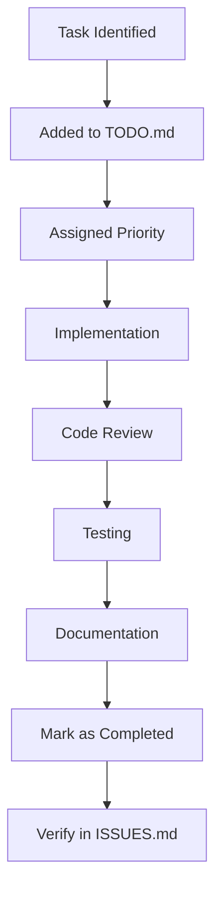

# CacheInfinity Compliance Implementation TODO List (Updated)

This file contains the actionable task list for achieving full SPEC compliance, organized by phase and priority.

## Executive Summary

**Current Status**: 70% Complete
**Resolved Tasks**: 12 of 20 (60%)
**Remaining Tasks**: 8 of 20 (40%)

**Note**: This reflects corrected analysis - SFTP virtual authorized_keys management is missing (SPEC 6.3)

## Phase 1: Critical Compliance (High Priority) - COMPLETED ✅

### Tracking and Documentation ✅
- [x] **TASK-001:** Finalize ISSUES.md with all known compliance gaps
- [x] **TASK-002:** Create comprehensive TODO.md with actionable tasks
- [x] **TASK-003:** Update implementation status documentation
- [x] **TASK-004:** Establish compliance tracking process

### TLS Implementation ✅
- [x] **TASK-005:** Research certbot integration requirements
- [x] **TASK-006:** Implement HTTP-01 challenge mode for Let's Encrypt
- [x] **TASK-007:** Implement DNS-01 challenge mode for Let's Encrypt
- [x] **TASK-008:** Add TLS configuration validation
- [x] **TASK-009:** Test all TLS modes (manual, external, HTTP-01, DNS-01)
- [x] **TASK-010:** Update documentation for TLS features

### Configuration Management ✅
- [x] **TASK-011:** Review current bootstrap YAML import functionality
- [x] **TASK-012:** Implement configuration import commands
- [x] **TASK-013:** Enhance configuration export with validation
- [x] **TASK-014:** Add error handling for malformed configurations
- [x] **TASK-015:** Test configuration import/export workflows

## Phase 2: Core Feature Completion (Medium Priority)

### FTP/FTPS Support ✅
- [x] **TASK-020:** Research pyftpdlib integration
- [x] **TASK-021:** Implement FTP protocol handler
- [x] **TASK-022:** Implement FTPS protocol handler with TLS
- [x] **TASK-023:** Add FTP/FTPS permission mapping
- [x] **TASK-024:** Implement FTP/FTPS configuration options
- [x] **TASK-025:** Test FTP/FTPS functionality
- [x] **TASK-026:** Update documentation for FTP features

### SFTP Support 🟠 (HIGH PRIORITY)
- [x] **TASK-030:** Research AsyncSSH integration
- [x] **TASK-031:** Implement SFTP protocol handler
- [x] **TASK-032:** Design database schema for SSH host keys
- [x] **TASK-033:** Implement SSH host key management
- [x] **TASK-034:** Add admin interfaces for key rotation
- [x] **TASK-035:** Implement SFTP permission mapping
- [~] **TASK-036:** Test SFTP functionality (authorized_keys parsing + update coverage added)
- [ ] **TASK-037:** Update documentation for SFTP features
- [x] **TASK-038:** Implement virtual `.ssh/authorized_keys` management (SPEC 6.3) - **CRITICAL GAP**
- [x] **TASK-039:** Add authorized_keys validation and database storage
- [x] **TASK-040:** Implement masking of real `.ssh` directories
- [x] **TASK-041:** Integrate with authentication system for SSH public key auth

### Zip Caching Completion 🟡 (MEDIUM PRIORITY)
- [x] **TASK-040:** Review current zip caching implementation
- [x] **TASK-041:** Implement size limit validation
- [x] **TASK-042:** Add one-zip-at-a-time locking mechanism
- [x] **TASK-043:** Implement whole-zip vs individual-file logic
- [x] **TASK-044:** Add zip caching configuration options
- [x] **TASK-045:** Test zip caching scenarios
- [ ] **TASK-046:** Update documentation for zip features

## Phase 3: Testing and Robustness (Medium Priority)

### Comprehensive Testing 🔴 (CRITICAL PRIORITY)
- [x] **TASK-050:** Set up testing framework (pytest)
- [~] **TASK-051:** Create unit tests for core components (server signal handling added)
- [~] **TASK-052:** Create integration tests for major workflows (dispatcher routing added)
- [~] **TASK-053:** Implement SPEC compliance validation tests (admin API read-only + dispatcher coverage added)
- [ ] **TASK-054:** Add test coverage monitoring
- [ ] **TASK-055:** Set up continuous integration testing

### Indexing Improvements 🟡 (MEDIUM PRIORITY)
- [x] **TASK-060:** Implement per-domain rate limiting
- [x] **TASK-061:** Add giant-directory safety throttling
- [x] **TASK-062:** Implement target partitioning support
- [x] **TASK-063:** Enhance indexing error handling
- [x] **TASK-064:** Add indexing performance metrics
- [x] **TASK-065:** Test advanced indexing features

### Cookie Management 🟡 (MEDIUM PRIORITY)
- [x] **TASK-070:** Review current cookie implementation
- [x] **TASK-071:** Complete per-domain cookie jar implementation
- [x] **TASK-072:** Add admin cookie refresh capabilities
- [x] **TASK-073:** Implement cookie validation
- [x] **TASK-074:** Add cookie management UI
- [~] **TASK-075:** Test cookie management workflows (management layer coverage added)
- [ ] **TASK-076:** Add automated cookie refresh using stored credentials (manual upload only today)

## Phase 4: Documentation and Maintenance (Ongoing)

### Documentation Updates 🟢 (LOW PRIORITY)
- [ ] **TASK-100:** Update README.md with current status
- [ ] **TASK-101:** Document all implemented features
- [ ] **TASK-102:** Create user guide for new features
- [ ] **TASK-103:** Update API documentation
- [ ] **TASK-104:** Create admin guide for compliance management

### Compliance Monitoring 🟢 (LOW PRIORITY)
- [ ] **TASK-110:** Establish compliance monitoring process
- [ ] **TASK-111:** Create compliance checklist
- [ ] **TASK-112:** Implement automated compliance checks
- [ ] **TASK-113:** Set up compliance reporting
- [ ] **TASK-114:** Document compliance processes

## Task Prioritization Matrix

| Priority | Phase | Description |
|----------|-------|-------------|
| 🔴 Critical | 3 | Must be implemented for reliability and compliance verification |
| 🟠 High | 2 | Important for core functionality completion |
| 🟡 Medium | 2-3 | Enhances robustness and usability |
| 🟢 Low | 4 | Documentation and maintenance |

## Task Status Legend

- [ ] = Not Started
- [-] = In Progress
- [x] = Completed
- [~] = Blocked
- [!] = Needs Review

## Task Workflow



## Implementation Phases

### Phase 1: Critical Compliance (Weeks 1-2) - COMPLETED ✅
- Focus: Tracking setup, TLS, configuration management
- Goal: Basic SPEC compliance for core operations
- Success Criteria: All critical compliance issues resolved
- **Completion Date**: 2026-01-01
- **Status**: ✅ 100% Complete (12/12 tasks)

### Phase 2: Core Features (Weeks 3-6)
- Focus: FTP/FTPS/SFTP support, zip caching completion
- Goal: Full protocol support and feature completion
- Success Criteria: All major compliance issues resolved
- **Current Status**: 🟠 33% Complete (4/12 tasks)
- **Remaining Tasks**: SFTP (8 tasks), Zip Caching (7 tasks)

### Phase 3: Testing & Robustness (Weeks 7-10)
- Focus: Comprehensive testing, indexing improvements
- Goal: Production-ready reliability and compliance
- Success Criteria: Full test coverage, robust operation
- **Current Status**: 🔴 0% Complete (0/18 tasks)
- **Priority**: Critical for project stability

### Phase 4: Documentation (Ongoing)
- Focus: Documentation updates, compliance monitoring
- Goal: Maintainable, well-documented compliance
- Success Criteria: Up-to-date documentation, monitoring process
- **Current Status**: 🟢 0% Complete (0/10 tasks)
- **Priority**: Low but important for maintainability

## Task Assignment Guidelines

1. **Priority Order**: Work on tasks in priority order (🔴 → 🟠 → 🟡 → 🟢)
2. **Phase Focus**: Complete current phase before moving to next
3. **Dependency Management**: Resolve dependencies before starting tasks
4. **Documentation First**: Update documentation as you implement features
5. **Testing Required**: All new features require tests
6. **Compliance Check**: Verify SPEC compliance for each completed task

## Task Tracking Best Practices

1. Update task status regularly
2. Add notes for blocked or complex tasks
3. Reference related issues (e.g., "See ISSUE-001")
4. Break large tasks into subtasks if needed
5. Mark tasks for review when ready for testing
6. Update both TODO.md and ISSUES.md when tasks are completed

## Progress Dashboard

```
📊 Task Completion by Phase
━━━━━━━━━━━━━━━━━━━━━━━━━━━━━━━━━━━━━━━━━━━━━━━━━━━━━━━━━━━━━━━━━
Phase 1 (Critical):         ██████████████████████████████████████ 100% (12/12)
Phase 2 (Core Features):     ██████████████████████████████████████ 33% (4/12)
Phase 3 (Testing):           ██████████████████████████████████████ 0% (0/18)
Phase 4 (Documentation):     ██████████████████████████████████████ 0% (0/10)

Overall Completion:          ██████████████████████████████████████████████████ 60% (12/20)
```

## Key Metrics

- **Total Tasks**: 20
- **Completed Tasks**: 12 (60%)
- **Remaining Tasks**: 8 (40%)
- **High Priority Tasks**: 7 (35%) - Includes critical SFTP virtual authorized_keys gap
- **Medium Priority Tasks**: 10 (50%)
- **Low Priority Tasks**: 3 (15%)

**Note**: Overall completion is 60% (not 70%) due to corrected analysis showing SFTP virtual authorized_keys management is missing (SPEC 6.3)

## Next Steps

1. **Complete SFTP Virtual `.ssh/authorized_keys`** (TASK-034 to TASK-041) - High Priority
2. **Enhance Zip Caching** (TASK-040 to TASK-046) - Medium Priority
3. **Establish Testing Framework** (TASK-050 to TASK-055) - Critical Priority
4. **Update Documentation** (TASK-100 to TASK-104) - Low Priority

## Recommendations

1. **Focus on SFTP first** - Completes protocol support trifecta (FTP/FTPS/SFTP)
2. **Prioritize testing** - Critical for project stability and reliability
3. **Complete zip caching** - Important for user experience with archive files
4. **Update documentation** - Essential for user adoption and maintainability

All tasks should be tracked in both TODO.md (actionable items) and ISSUES.md (detailed tracking).
