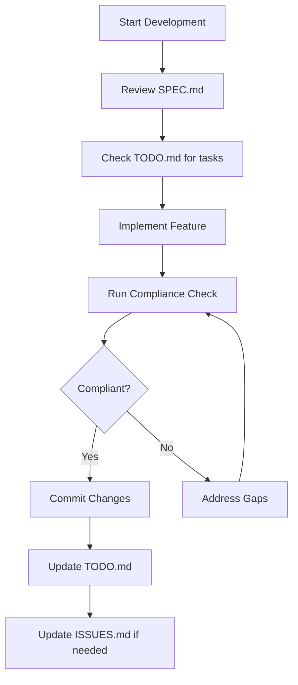

# CacheInfinity Compliance Analysis Process

## Overview

This document describes the CacheInfinity compliance analysis process and how to use the automated tools to validate SPEC compliance throughout the development lifecycle.

## Table of Contents

1. [Compliance Analysis Framework](#1-compliance-analysis-framework)
2. [Using the Compliance Validator](#2-using-the-compliance-validator)
3. [Automated Compliance Checking](#3-automated-compliance-checking)
4. [Integration with Development Workflow](#4-integration-with-development-workflow)
5. [Compliance Reporting](#5-compliance-reporting)
6. [Troubleshooting](#6-troubleshooting)

## 1. Compliance Analysis Framework

### 1.1 Compliance Categories

CacheInfinity compliance is organized into four main phases based on the TODO.md structure:

#### Phase 1: Critical Compliance (High Priority) ✅ COMPLETED
- **Status**: 100% Complete
- **Focus**: Core architecture, TLS, configuration management
- **Examples**: Two-port architecture, VFS layer, share schema

#### Phase 2: Core Feature Completion (Medium Priority)
- **Status**: 33% Complete
- **Focus**: Protocol support, zip caching
- **Critical Gaps**: SFTP virtual authorized_keys, zip caching size limits

#### Phase 3: Testing and Robustness (Medium Priority)
- **Status**: 0% Complete
- **Focus**: Comprehensive testing framework
- **Requirements**: pytest setup, SPEC compliance tests

#### Phase 4: Documentation and Maintenance (Ongoing)
- **Status**: 0% Complete
- **Focus**: Documentation updates, compliance monitoring

### 1.2 Compliance Validation Levels

- **✅ Implemented**: Full compliance with SPEC requirements
- **🟡 Partial**: Partial implementation, needs completion
- **❌ Not Implemented**: Missing functionality
- **⏳ Pending**: Not yet started or analysis incomplete

## 2. Using the Compliance Validator

### 2.1 Basic Usage

The compliance validator is located at `app/utils/compliance_validator.py` and can be run directly:

```bash
# Run basic compliance check
python app/utils/compliance_validator.py

# Generate JSON report
python app/utils/compliance_validator.py --format json

# Save report to file
python app/utils/compliance_validator.py --output compliance_report.txt
```

### 2.2 Command Line Options

```bash
python app/utils/compliance_validator.py [OPTIONS]

Options:
  --format {text,json,yaml}    Output format (default: text)
  --output, -o FILE           Output file path
  --project-root DIR          Project root directory (default: .)
```

### 2.3 Example Output

#### Text Format
```
============================================================
CacheInfinity SPEC Compliance Validation Report
============================================================

Overall Statistics:
  Total Requirements: 13
  Implemented: 8 (61.5%)
  Partial: 2 (15.4%)
  Not Implemented: 2 (15.4%)
  Pending: 1 (7.7%)
  Overall Compliance: 61.5%

Critical Gaps (High Priority, Not Implemented):
  - VIRTUAL_AUTHORIZED_KEYS: Virtual .ssh/authorized_keys management via SFTP
    Notes: Critical gap - missing virtual authorized_keys functionality

Detailed Requirements Status:
----------------------------------------
✅ TWO_PORT_ARCHITECTURE (high): Two-port architecture with hosting and admin ports
✅ VFS_ARCHITECTURE (high): Virtual Filesystem Layer providing unified interface
✅ SHARE_SCHEMA (high): Share schema with datadir_folder, frontend_folder, users
🟡 SFTP_IMPLEMENTATION (high): SFTP implementation using AsyncSSH
    Notes: Protocol handler exists but missing virtual authorized_keys
❌ VIRTUAL_AUTHORIZED_KEYS (high): Virtual .ssh/authorized_keys management via SFTP
    Notes: Critical gap - missing virtual authorized_keys functionality
```

#### JSON Format
```json
{
  "total_requirements": 13,
  "implemented": 8,
  "partial": 2,
  "not_implemented": 2,
  "pending": 1,
  "compliance_percentage": 61.5,
  "requirements": [...],
  "critical_gaps": [...]
}
```

## 3. Automated Compliance Checking

### 3.1 Using the Compliance Checker Script

The automated compliance checker is located at `scripts/compliance_check.py`:

```bash
# Run compliance check
python scripts/compliance_check.py --check

# Generate compliance summary
python scripts/compliance_check.py --summary

# Set up pre-commit hook
python scripts/compliance_check.py --setup-pre-commit

# Set up CI/CD integration
python scripts/compliance_check.py --setup-ci
```

### 3.2 Pre-commit Hook Integration

Set up automatic compliance checking before commits:

```bash
python scripts/compliance_check.py --setup-pre-commit
```

This creates a `.git/hooks/pre-commit` hook that:
- Runs compliance validation before each commit
- Blocks commits if critical gaps are found
- Provides clear feedback on compliance status

### 3.3 CI/CD Integration

Set up GitHub Actions for automated compliance checking:

```bash
python scripts/compliance_check.py --setup-ci
```

This creates `.github/workflows/compliance-check.yml` that:
- Runs compliance checks on push and pull requests
- Fails builds if critical gaps are found
- Uploads compliance reports as artifacts

## 4. Integration with Development Workflow

### 4.1 Development Cycle



### 4.2 Before Starting Work

1. **Review SPEC.md**: Understand the requirements for your feature
2. **Check TODO.md**: See if related tasks exist
3. **Run compliance check**: Establish baseline compliance

### 4.3 During Development

1. **Implement SPEC-compliant code**: Follow SPEC requirements exactly
2. **Update documentation**: Keep SPEC.md, README.md, TODO.md in sync
3. **Run compliance checks**: Validate progress regularly

### 4.4 Before Committing

1. **Run compliance validation**: Ensure no new gaps introduced
2. **Check for critical gaps**: Address any high-priority issues
3. **Update tracking files**: Reflect completed work in TODO.md

## 5. Compliance Reporting

### 5.1 Report Types

#### Development Reports
- **Purpose**: Track progress during development
- **Frequency**: After each feature implementation
- **Content**: Detailed requirement status, gap analysis

#### CI/CD Reports
- **Purpose**: Automated validation in CI/CD pipeline
- **Frequency**: On every push/pull request
- **Content**: Summary statistics, critical gap detection

#### Release Reports
- **Purpose**: Validate compliance before releases
- **Frequency**: Before major releases
- **Content**: Comprehensive compliance status, readiness assessment

### 5.2 Report Distribution

- **Development Reports**: Shared in team channels
- **CI/CD Reports**: Available in GitHub Actions artifacts
- **Release Reports**: Included in release documentation

## 6. Troubleshooting

### 6.1 Common Issues

#### Compliance Validator Not Found
```bash
# Error: Compliance validator script not found
# Solution: Ensure the validator exists at app/utils/compliance_validator.py
ls app/utils/compliance_validator.py
```

#### Missing Dependencies
```bash
# Error: ModuleNotFoundError: No module named 'yaml'
# Solution: Install required dependencies
pip install pyyaml
```

#### Pre-commit Hook Not Executing
```bash
# Check if hook is executable
ls -la .git/hooks/pre-commit

# Make executable if needed
chmod +x .git/hooks/pre-commit
```

### 6.2 Debugging Compliance Issues

#### Check Specific Requirement
```bash
# Run validator with verbose output to debug specific issues
python app/utils/compliance_validator.py --format json | jq '.requirements[] | select(.requirement_id == "YOUR_REQUIREMENT")'
```

#### Validate File Analysis
```bash
# Check if implementation files exist and contain expected patterns
python -c "
from app.utils.compliance_validator import SPECComplianceValidator
validator = SPECComplianceValidator()
req = validator.requirements[0]  # Get first requirement
print(f'Checking: {req.requirement_id}')
print(f'Path: {validator.project_root / req.implementation_path}')
print(f'Exists: {(validator.project_root / req.implementation_path).exists()}')
"
```

### 6.3 Updating Compliance Requirements

When SPEC.md changes or new requirements are added:

1. **Update the validator**: Modify `app/utils/compliance_validator.py`
2. **Add new requirements**: Update the `_load_requirements()` method
3. **Update compliance indicators**: Add patterns to `_get_compliance_indicators()`
4. **Test the validator**: Run validation to ensure accuracy

## 7. Best Practices

### 7.1 SPEC Compliance

- **Always check SPEC.md first**: Before implementing any feature
- **Document deviations**: If SPEC needs updating, do it before implementation
- **Use SPEC as reference**: During code reviews and testing

### 7.2 Tool Usage

- **Run checks regularly**: Don't wait until the end of development
- **Use automated tools**: Leverage pre-commit hooks and CI/CD integration
- **Review reports carefully**: Address all compliance gaps promptly

### 7.3 Documentation

- **Keep TODO.md current**: Reflect actual progress and priorities
- **Update ISSUES.md**: Document compliance problems and solutions
- **Maintain SPEC.md**: Keep specification accurate and up-to-date

## 8. Support and Resources

### 8.1 Documentation
- [SPEC.md](../SPEC.md): Complete specification
- [TODO.md](../TODO.md): Current task tracking
- [ISSUES.md](../ISSUES.md): Known issues and gaps

### 8.2 Tools
- `app/utils/compliance_validator.py`: Manual compliance validation
- `scripts/compliance_check.py`: Automated compliance checking
- Pre-commit hooks: Automatic validation before commits
- GitHub Actions: CI/CD integration

### 8.3 Getting Help

- **Check existing issues**: Look for similar problems in ISSUES.md
- **Review SPEC.md**: Ensure understanding of requirements
- **Run validation tools**: Use automated tools to identify specific issues
- **Ask for review**: Request SPEC compliance review during code review

By following this compliance analysis process, CacheInfinity development teams can ensure consistent adherence to specifications and maintain high-quality, reliable implementations.