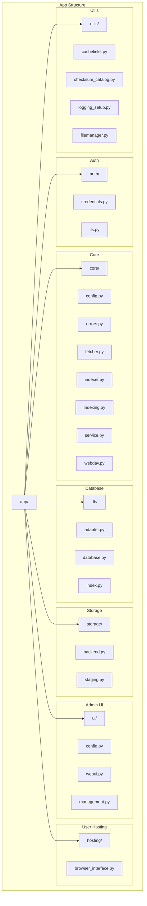

# CacheInfinity Codebase Reorganization Plan

## Overview
Reorganize the CacheInfinity codebase into a structured folder hierarchy with clear purposes for each directory and file, including new directories for user-facing interfaces and management functions.

## Current Structure Analysis
Based on the current codebase analysis, here are the files that need to be moved/renamed:

### Files Already in Correct Locations:
- **app/auth/credentials.py** ✓
- **app/core/config.py** ✓
- **app/core/errors.py** ✓
- **app/core/fetcher.py** ✓
- **app/core/indexer.py** ✓
- **app/core/indexing.py** ✓
- **app/core/service.py** ✓
- **app/core/webdav.py** ✓
- **app/db/adapter.py** ✓
- **app/db/database.py** ✓
- **app/db/index.py** ✓
- **app/storage/backend.py** ✓
- **app/storage/staging.py** ✓
- **app/ui/webui.py** ✓ (admin webui - stays in place)
- **app/ui/config.py** ✓
- **app/utils/cachelinks.py** ✓
- **app/utils/checksum_catalog.py** ✓
- **app/utils/logging_setup.py** ✓

### Files to Move/Rename:
1. **app/auth/tls_automation.py** → **app/auth/tls.py** (rename only)
2. **app/ui/webui_file_browser.py** and **app/ui/enhanced_file_browser_template.py** → **app/utils/filemanager.py** (merge and move)

### Special Cases:
- **app/cacheinfinity.py**: This is the entrypoint for running the server. Keep in place - no changes needed.
- **app/db/adapter.py**: This file handles database abstraction (SQLite/PostgreSQL). Should remain in app/db/ as it's already correctly placed.

## New Folder Structure

```
app/
├── auth/           # Authentication and security
│   ├── __init__.py
│   ├── credentials.py
│   └── tls.py          ← (renamed from tls_automation.py)
├── core/           # Core functions of the cacheinfinity server
│   ├── __init__.py
│   ├── config.py
│   ├── errors.py
│   ├── fetcher.py
│   ├── indexer.py
│   ├── indexing.py
│   ├── service.py        ← (moved from cacheinfinity.py)
│   └── webdav.py
├── db/             # Database interface functions
│   ├── __init__.py
│   ├── adapter.py
│   ├── database.py
│   └── index.py
├── storage/        # Backend storage interaction
│   ├── __init__.py
│   ├── backend.py
│   └── staging.py
├── ui/             # Admin UI driving functions
│   ├── __init__.py
│   ├── config.py
│   ├── webui.py        ← (admin webui - stays in place)
│   └── management.py     ← (new file for admin functions)
├── hosting/        # User-facing interface components
│   ├── __init__.py
│   └── browser_interface.py ← (new file for user browser interface)
└── utils/          # Helper functions
    ├── __init__.py
    ├── cachelinks.py
    ├── checksum_catalog.py
    ├── logging_setup.py
    └── filemanager.py      ← (merged from ui/webui_file_browser.py and ui/enhanced_file_browser_template.py)
```

## Mermaid Diagram



## Implementation Plan

### Phase 1: Preparation
1. **Analyze current codebase structure** - ✅ Complete
2. **Create new folder structure** - Create __init__.py files in each new directory

### Phase 2: File Movement
3. **Rename app/auth/tls_automation.py to app/auth/tls.py**
4. **Create app/hosting/ directory**
5. **Create app/ui/management.py for admin UI management functions**
6. **Create app/hosting/browser_interface.py for user browser interface**
7. **Merge app/ui/webui_file_browser.py and app/ui/enhanced_file_browser_template.py into app/utils/filemanager.py**

### Phase 3: Code Updates
8. **Update all import statements throughout the codebase to use relative imports**
9. **Update function calls to use the new management.py structure**
10. **Ensure the filemanager.py is properly integrated as a helper**

### Phase 4: Testing
11. **Test the reorganized codebase to ensure all functionality works correctly**
12. **Verify that all imports are working properly**
13. **Test both admin and user interfaces**

## Key Changes Summary

### New Directory Structure:
- **app/auth/**: Authentication and security (credentials.py, tls.py)
- **app/core/**: Core server functions (config.py, errors.py, fetcher.py, indexer.py, indexing.py, service.py, webdav.py)
- **app/db/**: Database interface functions (adapter.py, database.py, index.py)
- **app/storage/**: Backend storage interaction (backend.py, staging.py)
- **app/ui/**: Admin UI components (config.py, webui.py, management.py)
- **app/hosting/**: User-facing interface components (browser_interface.py)
- **app/utils/**: Helper functions (cachelinks.py, checksum_catalog.py, logging_setup.py, filemanager.py)

### File Renames:
- `app/auth/tls_automation.py` → `app/auth/tls.py`
- `app/ui/webui_file_browser.py` + `app/ui/enhanced_file_browser_template.py` → `app/utils/filemanager.py`

### New Files:
- `app/ui/management.py` - Admin UI management functions for code deduplication
- `app/hosting/browser_interface.py` - User browser interface

## Benefits of This Structure

1. **Clear Separation of Concerns**: Admin UI and user-facing interfaces are clearly separated
2. **Code Deduplication**: Management functions centralized in app/ui/management.py
3. **Helper Organization**: File manager moved to utils where it belongs as a helper
4. **User vs Admin**: Clear distinction between user-facing (hosting) and admin (ui) components
5. **Maintainability**: Better organization makes the codebase easier to maintain and extend

## Naming Conventions:
- All file names use snake_case
- Folder names are lowercase
- Clear, descriptive names that indicate purpose
- Consistent with Python packaging best practices

## Next Steps
Once you approve this plan, we can proceed with implementing the changes. The plan is comprehensive but manageable, with clear phases to ensure we don't break existing functionality.