# CacheInfinity Codebase Reorganization Plan

## Overview
Reorganize the CacheInfinity codebase into a structured folder hierarchy with clear purposes for each directory and file, based on the CacheInfinity specification. This reorganization will create a clear separation of concerns between authentication, core server functions, database operations, storage management, user interfaces, networking components, cache management, and utility functions.

## Current Structure Analysis
Based on the current codebase analysis and SPEC.md, here are the files that need to be moved/renamed:

### Files Already in Correct Locations:
- **app/auth/credentials.py** ✓ - Authentication and security
- **app/core/config.py** ✓ - Core configuration management
- **app/core/errors.py** ✓ - Core error definitions
- **app/core/indexing.py** ✓ - Indexing settings and configuration
- **app/core/service.py** ✓ - Core service orchestration
- **app/db/adapter.py** ✓ - Database abstraction layer
- **app/storage/backend.py** ✓ - Backend storage management
- **app/storage/staging.py** ✓ - Staging area management
- **app/ui/webui.py** ✓ - Admin Web UI (stays in place)
- **app/ui/cli.py** ✓ - Command line interface (stays in place)

### Files to Move/Rename:
1. **app/auth/tls_automation.py** → **app/auth/tls.py** (rename only)
2. **app/db/database.py** → **app/db/dbmanage.py** (rename for database operations)
3. **app/ui/config.py** → **app/ui/api.py** (rename to API interface)
4. **app/ui/webui_file_browser.py** and **app/ui/enhanced_file_browser_template.py** → **app/utils/filemanager.py** (merge and move)
5. **app/core/indexer.py** → **app/net/indexer.py** (move to networking folder)
6. **app/core/fetcher.py** → **app/net/fetcher.py** (move to networking folder)
7. **app/core/webdav.py** → **app/hosting/webdav.py** (move to user-facing hosting folder)
8. **app/core/logging_setup.py** → **app/core/logging.py** (rename for clarity)
9. **app/utils/cachelinks.py** → **app/cache/cachelinks.py** (move to cache folder)
10. **app/utils/checksum_catalog.py** → **app/cache/checksum.py** (move and rename for cache focus)

### New Files to Create:
1. **app/cache/** directory for cache and overlay management
2. **app/db/backends/** directory for database backend implementations
3. **app/storage/configuration.py** for config directory operations
4. **app/ui/management.py** for admin UI management functions
5. **app/hosting/browser_interface.py** for user browser interface
6. **app/db/backends/postgresql.py** for PostgreSQL functions
7. **app/db/backends/sqlite.py** for SQLite functions
8. **app/db/backupmgmt.py** for database backup/restore operations

### Special Cases:
- **app/cacheinfinity.py**: This is the entrypoint for running the server. Keep in place - no changes needed.

## New Folder Structure

```
app/
├── auth/           # Authentication and security (SPEC §6, §15.6)
│   ├── __init__.py
│   ├── credentials.py    # User credentials management
│   └── tls.py            # TLS certificate management (renamed from tls_automation.py)
├── core/           # Core functions of the cacheinfinity server (SPEC §2, §14.4)
│   ├── __init__.py
│   ├── config.py         # Configuration management
│   ├── errors.py         # Core error definitions
│   ├── indexing.py       # Indexing settings and configuration
│   ├── service.py        # Main service orchestration
│   ├── logging.py        # Logging setup (renamed from logging_setup.py)
│   └── webdav.py         # WebDAV provider (moved from core)
├── db/             # Database interface functions (SPEC §16)
│   ├── __init__.py
│   ├── adapter.py        # Database abstraction (SQLite/PostgreSQL)
│   ├── dbmanage.py       # Database operations and maintenance (renamed from database.py)
│   ├── index.py          # Database interface and operations
│   ├── backupmgmt.py     # Database backup/restore operations (new)
│   └── backends/         # Database backend implementations (new)
│       ├── __init__.py
│       ├── postgresql.py # PostgreSQL functions (new)
│       └── sqlite.py     # SQLite functions (new)
├── storage/        # Backend storage interaction (SPEC §10, §15.3)
│   ├── __init__.py
│   ├── backend.py        # Backend storage management
│   ├── staging.py        # Staging area management
│   └── configuration.py  # Config directory operations (new)
├── ui/             # Admin UI driving functions (SPEC §15)
│   ├── __init__.py
│   ├── webui.py          # Admin Web UI (stays in place)
│   ├── cli.py            # Command line interface (stays in place)
│   ├── api.py            # API interface (renamed from config.py)
│   └── management.py     # Admin UI management functions (new)
├── hosting/        # User-facing interface components (SPEC §15.2, §15.8)
│   ├── __init__.py
│   ├── webdav.py         # WebDAV provider (moved from core)
│   └── browser_interface.py # User browser interface (new)
├── net/            # Networking components (SPEC §10.4, §10.5)
│   ├── __init__.py
│   ├── indexer.py        # Indexing and remote listing management
│   └── fetcher.py        # Download management (curl-based)
├── cache/          # Cache and overlay management
│   ├── __init__.py
│   ├── cachelinks.py     # Cachelink parsing and management
│   └── checksum.py       # Checksum validation and comparison
└── utils/          # Helper functions (SPEC §15.4, §15.7)
    ├── __init__.py
    └── filemanager.py    # File browser and management (merged from ui)
```

## Mermaid Diagram

```mermaid
graph TB
    subgraph "App Structure"
        A[app/]
        
        subgraph "Auth - Authentication & Security"
            A1[auth/]
            A2[credentials.py]
            A3[tls.py]
        end
        
        subgraph "Core - Server Orchestration"
            C1[core/]
            C2[config.py]
            C3[errors.py]
            C4[indexing.py]
            C5[service.py]
            C6[logging.py]
            C7[webdav.py]
        end
        
        subgraph "Database - Persistence Layer"
            D1[db/]
            D2[adapter.py]
            D3[dbmanage.py]
            D4[index.py]
            D5[backupmgmt.py]
            D6[backends/]
            D7[postgresql.py]
            D8[sqlite.py]
        end
        
        subgraph "Storage - Backend & Config"
            S1[storage/]
            S2[backend.py]
            S3[staging.py]
            S4[configuration.py]
        end
        
        subgraph "Admin UI - Management Interface"
            U1[ui/]
            U2[webui.py]
            U3[cli.py]
            U4[api.py]
            U5[management.py]
        end
        
        subgraph "Hosting - User-Facing Services"
            H1[hosting/]
            H2[webdav.py]
            H3[browser_interface.py]
        end
        
        subgraph "Networking - Remote Operations"
            N1[net/]
            N2[indexer.py]
            N3[fetcher.py]
        end
        
        subgraph "Cache - Overlay Management"
            K1[cache/]
            K2[cachelinks.py]
            K3[checksum.py]
        end
        
        subgraph "Utils - Helper Functions"
            V1[utils/]
            V2[filemanager.py]
        end
    end
    
    A --> A1
    A --> C1
    A --> D1
    A --> S1
    A --> U1
    A --> H1
    A --> N1
    A --> K1
    A --> V1
```



## Implementation Plan

### Phase 1: Preparation
1. **Analyze current codebase structure** - ✅ Complete
2. **Create new folder structure** - Create __init__.py files in each new directory

### Phase 2: File Movement
3. **Rename app/auth/tls_automation.py to app/auth/tls.py**
4. **Rename app/db/database.py to app/db/dbmanage.py**
5. **Rename app/ui/config.py to app/ui/api.py**
6. **Rename app/core/logging_setup.py to app/core/logging.py**
7. **Rename app/utils/cachelinks.py to app/cache/cachelinks.py**
8. **Rename app/utils/checksum_catalog.py to app/cache/checksum.py**
9. **Create app/hosting/ directory**
10. **Create app/net/ directory**
11. **Create app/cache/ directory**
12. **Create app/db/backends/ directory**
13. **Create app/storage/configuration.py**
14. **Create app/ui/management.py**
15. **Create app/hosting/browser_interface.py**
16. **Create app/db/backupmgmt.py**
17. **Create app/db/backends/postgresql.py**
18. **Create app/db/backends/sqlite.py**
19. **Move app/core/indexer.py to app/net/indexer.py**
20. **Move app/core/fetcher.py to app/net/fetcher.py**
21. **Move app/core/webdav.py to app/hosting/webdav.py**
22. **Move app/utils/cachelinks.py to app/cache/cachelinks.py**
23. **Move app/utils/logging_setup.py to app/core/logging.py**
24. **Move app/utils/checksum_catalog.py to app/cache/checksum.py**
25. **Merge app/ui/webui_file_browser.py and app/ui/enhanced_file_browser_template.py into app/utils/filemanager.py**

### Phase 3: Code Updates
26. **Update all import statements throughout the codebase to use relative imports**
27. **Update function calls to use the new management.py structure**
28. **Ensure the filemanager.py is properly integrated as a helper**

### Phase 4: Testing
29. **Test the reorganized codebase to ensure all functionality works correctly**
30. **Verify that all imports are working properly**
31. **Test both admin and user interfaces**

## Key Changes Summary

### New Directory Structure:
- **app/auth/**: Authentication and security (credentials.py, tls.py) - SPEC §6, §15.6
- **app/core/**: Core server functions (config.py, errors.py, indexing.py, service.py, logging.py, webdav.py) - SPEC §2, §14.4
- **app/db/**: Database interface functions (adapter.py, dbmanage.py, index.py, backupmgmt.py, backends/) - SPEC §16
- **app/storage/**: Backend storage interaction (backend.py, staging.py, configuration.py) - SPEC §10, §15.3
- **app/ui/**: Admin UI components (webui.py, cli.py, api.py, management.py) - SPEC §15
- **app/hosting/**: User-facing interface components (webdav.py, browser_interface.py) - SPEC §15.2, §15.8
- **app/net/**: Networking components (indexer.py, fetcher.py) - SPEC §10.4, §10.5
- **app/cache/**: Cache and overlay management (cachelinks.py, checksum.py)
- **app/utils/**: Helper functions (filemanager.py) - SPEC §15.4, §15.7

### File Renames:
- `app/auth/tls_automation.py` → `app/auth/tls.py`
- `app/db/database.py` → `app/db/dbmanage.py`
- `app/ui/config.py` → `app/ui/api.py`
- `app/core/logging_setup.py` → `app/core/logging.py`
- `app/utils/cachelinks.py` → `app/cache/cachelinks.py`
- `app/utils/checksum_catalog.py` → `app/cache/checksum.py`

### File Moves:
- `app/core/indexer.py` → `app/net/indexer.py`
- `app/core/fetcher.py` → `app/net/fetcher.py`
- `app/core/webdav.py` → `app/hosting/webdav.py`
- `app/utils/cachelinks.py` → `app/cache/cachelinks.py`
- `app/utils/logging_setup.py` → `app/core/logging.py`
- `app/utils/checksum_catalog.py` → `app/cache/checksum.py`

### New Files:
- `app/cache/` directory with `__init__.py`
- `app/db/backends/` directory with `__init__.py`, `postgresql.py`, `sqlite.py`
- `app/storage/configuration.py` - Config directory operations
- `app/ui/management.py` - Admin UI management functions
- `app/hosting/browser_interface.py` - User browser interface
- `app/db/backupmgmt.py` - Database backup/restore operations

## Benefits of This Structure

1. **Clear Separation of Concerns**: Based on SPEC.md, each directory has a clear purpose:
   - **Auth**: Authentication and security (SPEC §6, §15.6)
   - **Core**: Server orchestration and configuration (SPEC §2, §14.4)
   - **DB**: Database operations, maintenance, and backend implementations (SPEC §16)
   - **Storage**: Backend, staging, and config directory management (SPEC §10, §15.3)
   - **UI**: Admin management interface with separate Web UI, CLI, API, and management layers (SPEC §15)
   - **Hosting**: User-facing services like WebDAV (SPEC §15.2, §15.8)
   - **Net**: Networking and remote operations (SPEC §10.4, §10.5)
   - **Cache**: Cache and overlay management with cachelinks and checksums
   - **Utils**: Helper functions and file management (SPEC §15.4, §15.7)

2. **Database Specialization**: Dedicated app/db/backends/ folder for PostgreSQL and SQLite implementations, with adapter handling abstraction

3. **UI Layer Separation**: Clear separation between Web UI, CLI, API, and management functions

4. **Cache Management**: Dedicated app/cache/ folder for cachelinks and checksum validation

5. **Networking Specialization**: Dedicated app/net/ folder for networking components (indexer and fetcher)

6. **User Interface Organization**: WebDAV provider moved to hosting where it belongs as a user-facing component

7. **Code Deduplication**: Management functions centralized in app/ui/management.py

8. **Maintainability**: Better organization makes the codebase easier to maintain and extend

## Naming Conventions:
- All file names use snake_case
- Folder names are lowercase
- Clear, descriptive names that indicate purpose
- Consistent with Python packaging best practices
- Aligns with SPEC.md terminology and architecture

## Next Steps
Once you approve this plan, we can proceed with implementing the changes. The plan is comprehensive but manageable, with clear phases to ensure we don't break existing functionality.