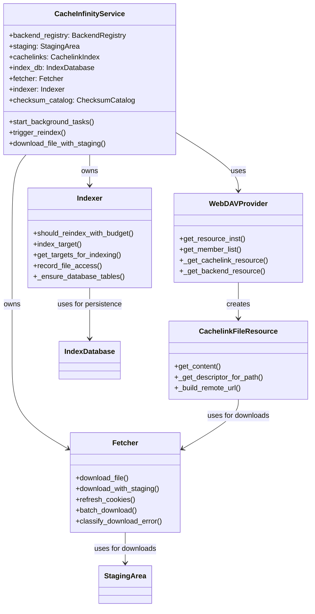

# CacheInfinity Implementation Completion Plan

## Current Status Analysis

Based on my examination of the codebase, I've identified that CacheInfinity is approximately **70% complete** with a solid foundation, but several critical components need to be implemented to achieve full SPEC.md compliance.

### ✅ **Completed Components (70%)**

1. **Core Infrastructure** - Fully implemented
   - Database layer with SQLite/PostgreSQL support
   - Authentication system with multiple auth methods
   - Comprehensive Web UI with all major features
   - Configuration system with two-file approach
   - Service orchestration and management layer

2. **WebDAV Integration** - Fully implemented
   - Custom WsgiDAV provider with virtual directory support
   - On-demand caching logic structure
   - Backend and cachelink resource classes
   - Complete DAV property support

3. **Storage Management** - Fully implemented
   - Multi-backend support
   - Staging area management
   - Atomic file operations

4. **Web UI** - Fully implemented
   - Comprehensive admin interface
   - File browser with sorting, filtering, search
   - User, cachelink, cookie, and settings management
   - Real-time status monitoring

### ⚠️ **Partially Implemented Components (25%)**

1. **Indexing System** (`app/net/indexer.py`) - **30% Complete**
   - Remote listing fetcher for HTTP/FTP
   - HTML and FTP directory parsing
   - Basic indexing logic structure
   - Database table creation for indexing
   - **Missing**: Service layer integration, progressive indexing, conditional requests, access-aware hotness tracking

2. **Fetcher System** (`app/net/fetcher.py`) - **40% Complete**
   - Curl-based download with cookie support
   - Robust retry mechanisms with exponential backoff
   - Resume partial downloads
   - Checksum verification
   - **Missing**: Service layer integration, cookie refresh for authenticated sources, staging area integration

3. **TLS Automation** (`app/auth/tls.py`) - **50% Complete**
   - TLS settings configuration
   - Manual certificate support
   - HTTP-01 and DNS-01 challenge frameworks
   - **Missing**: Let's Encrypt integration, automatic certificate renewal

4. **Checksum Catalog** (`app/cache/checksum.py`) - **60% Complete**
   - ChecksumCalculator class complete
   - ChecksumCatalog class with database integration
   - **Missing**: Redump/No-Intro catalog support, TorrentZip CRC extraction

### ❌ **Not Implemented Components (10%)**

1. **CLI Interface** (`app/ui/cli.py`) - **0% Complete**
   - CLI module structure missing
   - Command-line argument parsing missing
   - Management layer integration missing

## Critical Gaps Analysis

### **HIGH PRIORITY GAPS**

#### 1. **Indexing System Integration** - **CRITICAL**
- **Impact**: Cannot refresh remote listings automatically
- **SPEC.md Requirements**: Section 9 (Indexing)
- **Missing Features**:
  - Functional integration with service layer
  - Progressive indexing with budgets
  - Conditional HTTP requests (ETag/Last-Modified)
  - Access-aware hotness tracking implementation
  - Budget-based scheduling implementation

#### 2. **Fetcher System Integration** - **CRITICAL**
- **Impact**: Cannot download files on-demand
- **SPEC.md Requirements**: Section 10 (Read-through caching)
- **Missing Features**:
  - Integration with service layer
  - Cookie refresh for authenticated sources
  - Integration with staging area
  - Advanced retry strategies

#### 3. **CLI Interface** - **HIGH**
- **Impact**: No command-line administration interface
- **SPEC.md Requirements**: CLI management capabilities
- **Missing Features**:
  - CLI module structure
  - Command-line argument parsing
  - Integration with management layer

## Implementation Plan

### **Phase 1: Critical Infrastructure Integration**

#### 1.1 Complete Indexing System Integration
**Objective**: Make indexing system functional and integrated

**Tasks**:
- Integrate `app/net/indexer.py` with service layer
- Implement progressive indexing with budgets
- Add conditional HTTP requests (ETag/Last-Modified)
- Implement access-aware hotness tracking
- Add daily indexing scheduler
- Implement `_get_cachelink_descriptor()` method in Indexer class
- Connect indexer to background task system

**Success Criteria**:
- Remote listings refresh automatically
- Access tracking works correctly
- Budget constraints respected
- Integration tests pass

#### 1.2 Complete Fetcher System Integration
**Objective**: Make fetcher system functional and integrated

**Tasks**:
- Integrate `app/net/fetcher.py` with service layer
- Implement cookie refresh for authenticated sources
- Add integration with staging area
- Implement advanced retry strategies
- Connect fetcher to background task system
- Implement pending downloads queue management

**Success Criteria**:
- Files download on-demand successfully
- Cookie authentication works
- Downloads resume after interruptions
- Integration tests pass

#### 1.3 Create CLI Interface
**Objective**: Implement command-line interface

**Tasks**:
- Create `app/ui/cli.py` module
- Implement CLI argument parsing
- Add CLI commands for all management operations
- Integrate with management layer
- Add CLI authentication (API key system)

**Success Criteria**:
- All WebUI operations available via CLI
- CLI authentication works
- Command help and documentation
- Integration tests pass

### **Phase 2: Advanced Features**

#### 2.1 Complete TLS Automation
**Objective**: Full Let's Encrypt integration

**Tasks**:
- Implement Let's Encrypt certificate acquisition
- Add automatic certificate renewal
- Implement certificate validation
- Add DNS-01 challenge support
- Add HTTP-01 challenge support

**Success Criteria**:
- Automatic certificate management
- Certificate renewal works
- Both challenge types supported

#### 2.2 Complete Checksum Catalog System
**Objective**: File integrity validation

**Tasks**:
- Implement Redump/No-Intro catalog support
- Add TorrentZip CRC extraction
- Add catalog persistence and querying
- Integrate with fetcher for checksum verification

**Success Criteria**:
- Catalog system functional
- File integrity validation works
- Integration with fetcher

## System Architecture

## Implementation Strategy

### **Approach**
1. **Start with Critical Infrastructure**: Focus on integrating existing stub implementations
2. **Incremental Integration**: Test each component as it's integrated
3. **Maintain Backward Compatibility**: Ensure existing functionality continues to work
4. **Comprehensive Testing**: Add tests for each integrated component

### **Key Principles**
1. **Build on Existing Foundation**: Leverage the solid architecture already in place
2. **Incremental Progress**: Complete one component at a time
3. **Quality Assurance**: Test thoroughly at each step
4. **Documentation**: Document as we implement

## Success Criteria

### **MVP (Minimum Viable Product)**
- [ ] All SPEC.md core requirements implemented
- [ ] Indexing system functional
- [ ] Fetcher system functional
- [ ] CLI interface available
- [ ] Web UI fully functional
- [ ] Configuration system complete

### **Complete Implementation**
- [ ] All SPEC.md requirements met
- [ ] Advanced authentication methods
- [ ] TLS automation
- [ ] Comprehensive testing
- [ ] Complete documentation
- [ ] Performance optimization

## Next Steps

1. **Focus on Phase 1**: Complete indexing and fetcher integration
2. **Create CLI interface**: Essential for administration
3. **Add comprehensive testing**: Ensure reliability
4. **Complete advanced features**: Authentication, TLS, checksums