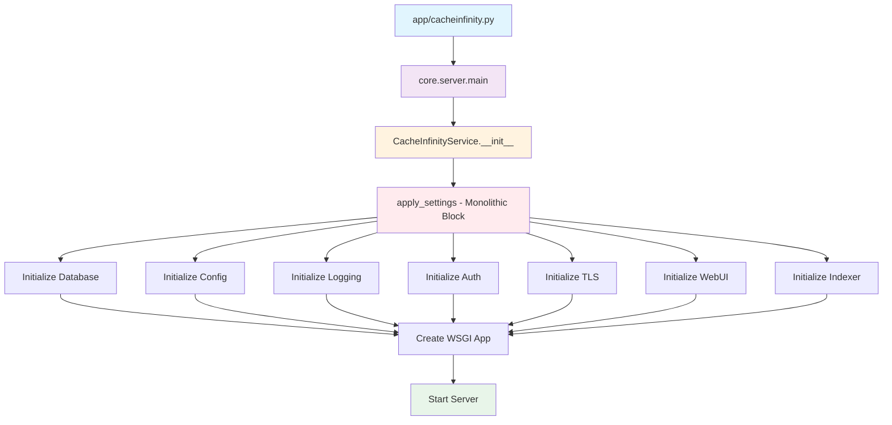
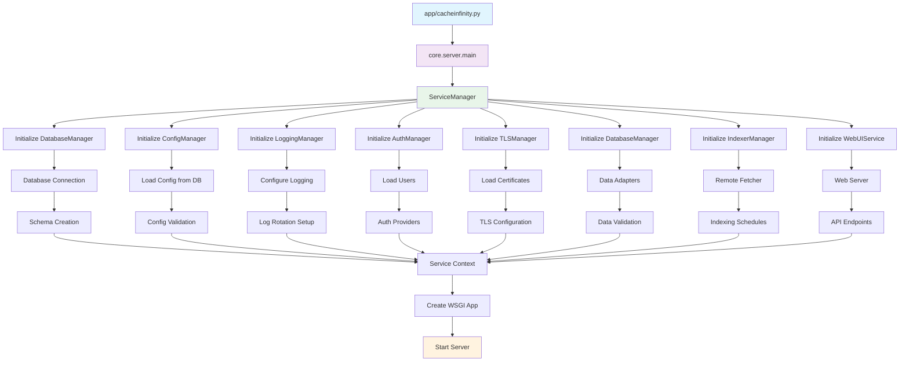
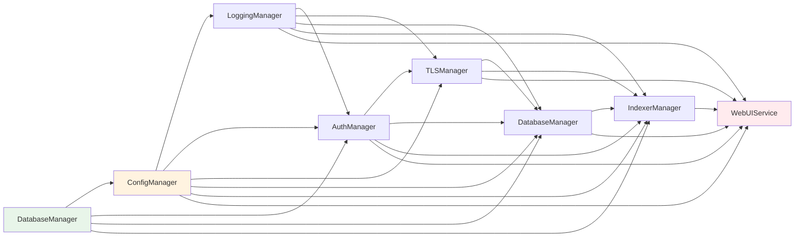
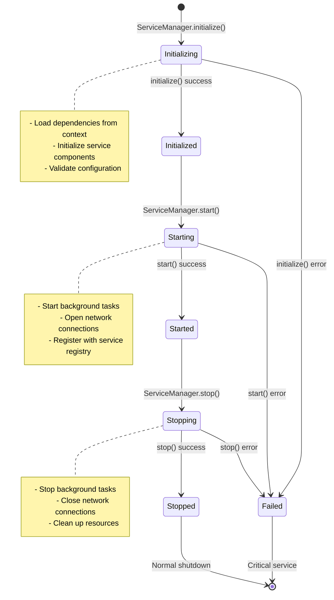
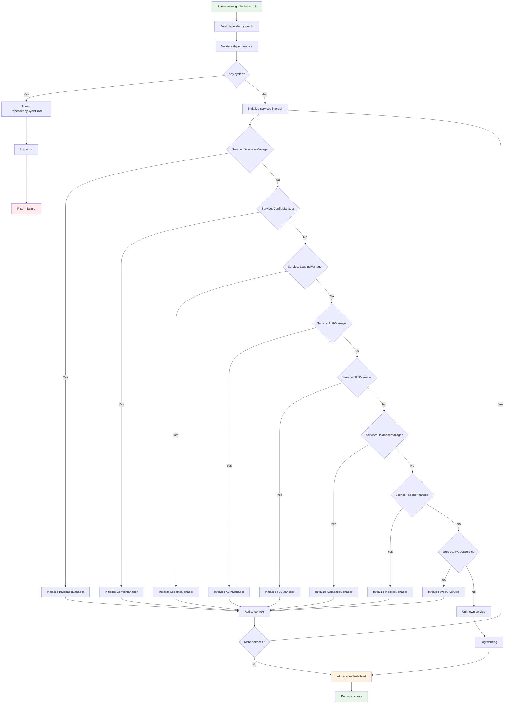
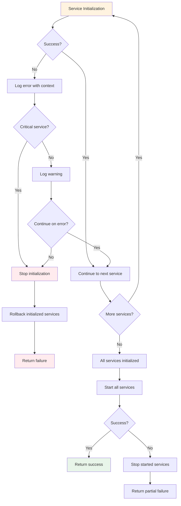

# Mermaid Diagrams for CacheInfinity Initialization Flow

## Current vs Target Architecture Comparison

### Current Architecture (Monolithic)


### Target Architecture (Service-Oriented)


## Service Dependencies

### Service Dependency Graph


## Service Lifecycle

### Service Lifecycle Management


## Service Manager Flow

### Service Manager Initialization Flow


## Error Handling Strategy

### Error Handling Flow


## Service Context

### Service Context Structure

```mermaid
graph TB
    A[Service Context] --> B[DatabaseManager]
    A --> C[ConfigManager]
    A --> D[LoggingManager]
    A --> E[AuthManager]
    A --> F[TLSManager]
    A --> G[DatabaseManager]
    A --> H[IndexerManager]
    A --> I[WebUIService]
    
    B --> B1[Database Connection]
    B --> B2[Schema Version]
    B --> B3[Connection Pool]
    
    C --> C1[Configuration Data]
    C --> C2[Config Version]
    C --> C3[Validation Status]
    
    D --> D1[Logger Instance]
    D --> D2[Log Level]
    D --> D3[Log Handlers]
    
    E --> E1[Auth Providers]
    E --> E2[User Manager]
    E --> E3[Session Store]
    
    F --> F1[Certificate Info]
    F --> F2[TLS Config]
    F --> F3[Renewal Status]
    
    G --> G1[Data Adapters]
    G --> G2[Validation Rules]
    G --> G3[Cache Layer]
    
    H --> H1[Fetcher Instance]
    H --> H2[Indexing Schedules]
    H --> H3[Hotness Tracker]
    
    I --> I1[Web Server]
    I --> I2[API Routes]
    I --> I3[Auth Middleware]
    
    style A fill:#e8f5e9
    style B fill:#fff3e0
    style C fill:#fff3e0
    style D fill:#fff3e0
    style E fill:#fff3e0
    style F fill:#fff3e0
    style G fill:#fff3e0
    style H fill:#fff3e0
    style I fill:#fff3e0
```


## Migration Timeline

### Migration Phases
```mermaid
gantt
    title CacheInfinity Initialization Flow Migration
    dateFormat  YYYY-MM-DD
    section Foundation
    BaseService Interface       :a1, 2024-01-01, 7d
    ServiceManager              :a2, after a1, 10d
    Exception Hierarchy         :a3, after a1, 5d
    section Core Services
    DatabaseManager             :b1, after a2, 10d
    ConfigManager               :b2, after b1, 10d
    LoggingManager              :b3, after b2, 7d
    section Authentication
    AuthManager                 :c1, after b2, 14d
    TLSManager                  :c2, after c1, 10d
    section Data Layer
    DatabaseManager             :d1, after b1, 14d
    IndexerManager              :d2, after d1, 14d
    section Web Interface
    WebUIService                :e1, after c2, 14d
    Integration Testing         :e2, after e1, 10d
    section Deployment
    Performance Testing         :f1, after e2, 7d
    Documentation               :f2, after e2, 10d
    Production Deployment       :f3, after f1 f2, 5d