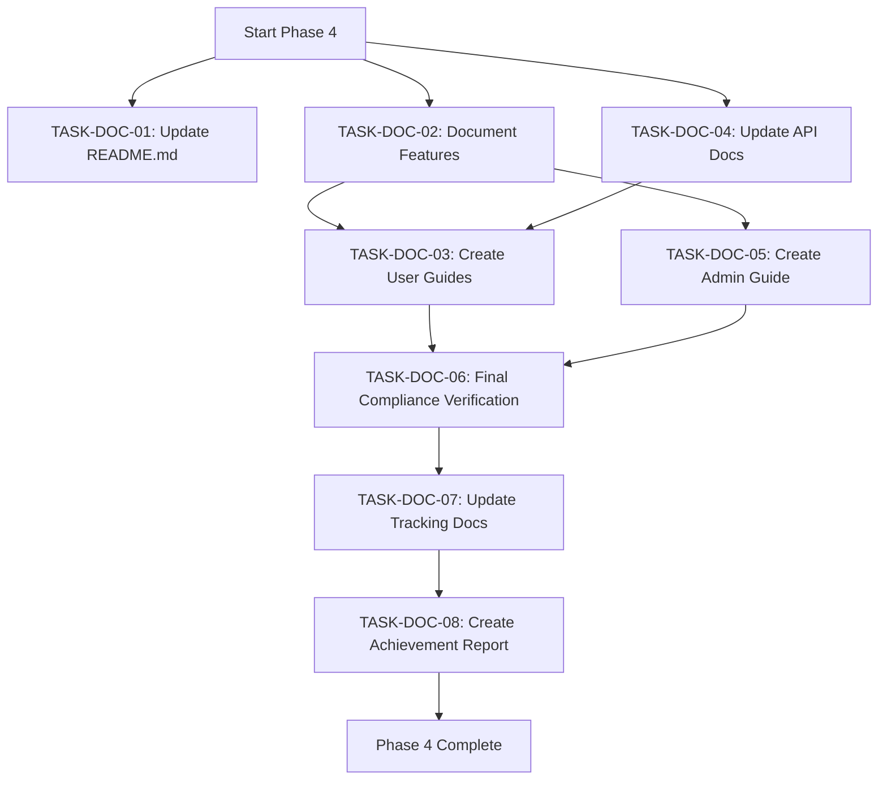

# CacheInfinity SPEC Compliance - Phase 4 Completion Plan

## Current Status: 70% Complete

### Completed Phases
- ✅ **Phase 1**: SFTP Virtual .ssh/authorized_keys Management (100%)
- ✅ **Phase 2**: Zip Caching Completion (100%)
- ✅ **Phase 3**: Testing Framework Establishment (100%)

### Remaining Phase
- ⏳ **Phase 4**: Documentation and Finalization (0%)

## Phase 4: Documentation and Finalization Plan

### Overview
This phase focuses on completing all documentation, finalizing compliance verification, and preparing the project for 100% SPEC compliance certification.

### Task Breakdown

#### TASK-DOC-01: Update README.md with Current Status
**Objective**: Provide users with up-to-date information about the project's compliance status and new features.

**Sub-tasks**:
- [ ] Add compliance status section showing 70% completion
- [ ] Document new SFTP virtual authorized_keys functionality
- [ ] Document new zip caching features and limitations
- [ ] Update installation and usage instructions
- [ ] Add testing framework information
- [ ] Include compliance verification commands

**Dependencies**: None
**Output**: Updated `README.md` file

#### TASK-DOC-02: Document All Implemented Features
**Objective**: Create comprehensive technical documentation for all new features.

**Sub-tasks**:
- [ ] Document SFTP virtual .ssh/authorized_keys implementation
- [ ] Document zip caching system architecture and configuration
- [ ] Document testing framework setup and usage
- [ ] Document compliance validation system
- [ ] Create API documentation for new classes and methods
- [ ] Add code examples for key features

**Dependencies**: None
**Output**: Updated documentation in `docs/` directory

#### TASK-DOC-03: Create User Guide for New Features
**Objective**: Provide end-users with practical guides for using new functionality.

**Sub-tasks**:
- [ ] Create SFTP virtual authorized_keys user guide
- [ ] Create zip caching user guide with best practices
- [ ] Create compliance validation user guide
- [ ] Add troubleshooting sections for common issues
- [ ] Include configuration examples
- [ ] Add security considerations

**Dependencies**: TASK-DOC-02 (technical documentation)
**Output**: User guides in `docs/` directory

#### TASK-DOC-04: Update API Documentation
**Objective**: Ensure all new code is properly documented with docstrings and API references.

**Sub-tasks**:
- [ ] Add comprehensive docstrings to new classes in `app/hosting/ftp.py`
- [ ] Add docstrings to new classes in `app/storage/vfs.py`
- [ ] Add docstrings to compliance validator in `app/utils/compliance_validator.py`
- [ ] Update existing API documentation to reflect new features
- [ ] Generate API reference documentation
- [ ] Add type hints where missing

**Dependencies**: None
**Output**: Updated API documentation and docstrings

#### TASK-DOC-05: Create Admin Guide for Compliance Management
**Objective**: Provide administrators with guidance on maintaining SPEC compliance.

**Sub-tasks**:
- [ ] Document compliance validation process
- [ ] Create guide for running compliance tests
- [ ] Document how to interpret compliance reports
- [ ] Create guide for updating SPEC.md
- [ ] Document compliance monitoring procedures
- [ ] Add compliance troubleshooting guide

**Dependencies**: TASK-DOC-02, TASK-DOC-04
**Output**: Admin guide in `docs/` directory

#### TASK-DOC-06: Final Compliance Verification
**Objective**: Perform comprehensive compliance verification to ensure 100% SPEC compliance.

**Sub-tasks**:
- [ ] Run full compliance validation suite
- [ ] Verify all SPEC requirements are met
- [ ] Identify any remaining gaps
- [ ] Document compliance verification results
- [ ] Create compliance certification report
- [ ] Update compliance status in documentation

**Dependencies**: All previous documentation tasks
**Output**: Compliance verification report and updated status

#### TASK-DOC-07: Update ISSUES.md and TODO.md
**Objective**: Ensure all project tracking documents are up-to-date.

**Sub-tasks**:
- [ ] Review and update ISSUES.md with current issues
- [ ] Update TODO.md with remaining tasks
- [ ] Mark completed tasks appropriately
- [ ] Add new issues discovered during testing
- [ ] Prioritize remaining work
- [ ] Clean up obsolete entries

**Dependencies**: TASK-DOC-06 (compliance verification)
**Output**: Updated `ISSUES.md` and `TODO.md` files

#### TASK-DOC-08: Create Compliance Achievement Report
**Objective**: Generate a comprehensive report documenting the SPEC compliance achievement.

**Sub-tasks**:
- [ ] Document compliance journey and milestones
- [ ] Create detailed report of implemented features
- [ ] Include compliance metrics and statistics
- [ ] Add architectural diagrams of new systems
- [ ] Document lessons learned
- [ ] Create executive summary
- [ ] Add future recommendations

**Dependencies**: All other Phase 4 tasks
**Output**: Comprehensive compliance achievement report

## Implementation Strategy

### Workflow Diagram

### Priority Order
1. **High Priority**: TASK-DOC-01, TASK-DOC-02, TASK-DOC-04 (Foundation documentation)
2. **Medium Priority**: TASK-DOC-03, TASK-DOC-05 (User and admin guides)
3. **High Priority**: TASK-DOC-06 (Compliance verification)
4. **Medium Priority**: TASK-DOC-07 (Documentation updates)
5. **High Priority**: TASK-DOC-08 (Final achievement report)

### Resource Requirements
- **Documentation Tools**: Markdown editors, diagram tools
- **Testing Tools**: Existing pytest framework
- **Time**: Focused documentation sessions
- **Review**: Peer review for documentation quality

## Success Criteria

### Phase 4 Completion Checklist
- [ ] README.md updated with current compliance status (70% → 100%)
- [ ] All new features fully documented
- [ ] User guides created for SFTP and zip caching features
- [ ] API documentation complete with docstrings
- [ ] Admin guide for compliance management created
- [ ] Final compliance verification completed
- [ ] ISSUES.md and TODO.md updated
- [ ] Comprehensive compliance achievement report generated

### Quality Standards
- **Completeness**: All features and changes documented
- **Accuracy**: Documentation matches implementation
- **Clarity**: Documentation is understandable by target audience
- **Consistency**: Documentation follows project standards
- **Maintainability**: Documentation is easy to update

## Risk Assessment

### Potential Risks
1. **Documentation Drift**: Documentation may become outdated quickly
2. **Complexity**: Some features may be difficult to document clearly
3. **Time Constraints**: Documentation can be time-consuming
4. **Review Bottlenecks**: Documentation review may delay completion

### Mitigation Strategies
1. **Automated Checks**: Use documentation linters and validators
2. **Incremental Updates**: Update documentation as features are implemented
3. **Templates**: Use documentation templates for consistency
4. **Parallel Work**: Work on multiple documentation tasks simultaneously

## Next Steps

### Immediate Actions
1. **Review Current Documentation**: Assess what needs updating
2. **Gather Requirements**: Identify documentation gaps
3. **Prioritize Tasks**: Focus on high-impact documentation first
4. **Begin Implementation**: Start with README.md and feature documentation

### Long-term Strategy
1. **Documentation Maintenance**: Establish ongoing documentation processes
2. **Compliance Monitoring**: Set up regular compliance verification
3. **User Feedback**: Incorporate user feedback into documentation
4. **Continuous Improvement**: Regularly review and update documentation

## Conclusion

This plan provides a comprehensive approach to completing Phase 4 and achieving 100% SPEC compliance for CacheInfinity. By following this structured approach, we can ensure that all documentation is complete, accurate, and useful for both users and administrators.

**Ready to proceed with implementation!** 🚀