# CacheInfinity Rclone Mandatory Integration Plan

## Overview

This plan outlines the comprehensive implementation of making Rclone mandatory with direct rclone-python integration, replacing the current optional RC API approach. The plan includes 19 detailed steps covering dependency management, database schema changes, code refactoring, deployment updates, and comprehensive testing.

## Prerequisites

- SPEC.md updated to reflect mandatory Rclone requirement
- Current CacheInfinity codebase with optional Rclone support
- Development environment with Python 3.14+ and rclone-python library

## Implementation Steps

### 1. Update SPEC.md to reflect mandatory Rclone requirement and new integration approach ✅ COMPLETED

**Status**: Completed
**Description**: Updated SPEC.md to reflect mandatory Rclone requirement and direct rclone-python integration approach
**Key Changes**:
- Made Rclone mandatory for all cloud provider integrations
- Replaced RC API with direct rclone-python calls
- Updated configuration to be database-backed only
- Removed external config file references

### 2. Add rclone-python dependency to pyproject.toml

**Status**: Pending
**Description**: Add rclone-python as a required dependency in the project configuration
**Implementation**:
- Add `rclone-python = "^1.0.0"` to `[project.dependencies]` in pyproject.toml
- Update Dockerfile to install rclone-python dependency
- Update systemd deployment documentation to include rclone-python requirement

### 3. Remove Rclone enabled flag from RcloneSettings and database schema

**Status**: Pending
**Description**: Remove the optional `enabled` field from RcloneSettings and update database schema
**Implementation**:
- Modify `RcloneSettings` class to remove `enabled` field
- Update database schema to remove `enabled` column from rclone_settings table
- Update all code references that check `enabled` flag

### 4. Update database migration to remove enabled column and make Rclone required

**Status**: Pending
**Description**: Create database migration to remove enabled column and enforce Rclone requirement
**Implementation**:
- Create migration script to drop `enabled` column from rclone_settings table
- Add validation to ensure Rclone configuration is present during startup
- Update database initialization to require Rclone settings

### 5. Modify RcloneSettings to remove enabled field and remove config_path

**Status**: Pending
**Description**: Update RcloneSettings class to reflect mandatory Rclone requirement with database-only configuration
**Implementation**:
- Remove `enabled: bool = False` field
- Remove `config_path` field entirely (all configuration stored in database)
- Add database-backed configuration fields for rclone remotes and settings
- Update validation logic to ensure Rclone configuration is always present in database
- Add error handling for missing Rclone configuration in database

### 6. Update all Rclone initialization code to require Rclone at startup

**Status**: Pending
**Description**: Modify startup code to require Rclone configuration and fail gracefully if missing
**Implementation**:
- Update `core/services.py` to validate Rclone configuration during startup
- Add startup validation that checks for rclone-python availability
- Implement graceful failure with clear error messages if Rclone is not configured
- Update logging to indicate Rclone status during startup

### 7. Replace RC API calls with direct rclone-python library calls

**Status**: Pending
**Description**: Replace all RC API calls with direct rclone-python library calls
**Implementation**:
- Identify all RC API usage in the codebase
- Replace with equivalent rclone-python library calls
- Update error handling to use rclone-python exceptions
- Ensure all rclone operations use direct API calls instead of HTTP requests

### 8. Update WebUI to use direct rclone-python instead of RC API

**Status**: Pending
**Description**: Update WebUI rclone operations to use direct rclone-python calls
**Implementation**:
- Modify `app/ui/web/assets/js/cachelinks.js` to remove RC API calls
- Update WebUI backend in `app/ui/backend.py` to use rclone-python directly
- Update Rclone tab interface to use direct rclone-python operations
- Ensure all WebUI rclone operations work with direct integration

### 9. Update Admin API to use direct rclone-python calls

**Status**: Pending
**Description**: Update Admin API rclone endpoints to use direct rclone-python calls
**Implementation**:
- Modify `app/ui/api.py` rclone endpoints to use rclone-python
- Update API response format to match direct rclone-python output
- Ensure API authentication and authorization still work with direct calls
- Update API documentation for new rclone-python integration

### 10. Update CLI to use direct rclone-python calls

**Status**: Pending
**Description**: Update CLI rclone commands to use direct rclone-python calls
**Implementation**:
- Modify `app/ui/cli.py` rclone commands to use rclone-python
- Update CLI error handling for rclone-python exceptions
- Ensure CLI commands work with direct rclone-python integration
- Update CLI help text and documentation

### 11. Update fetcher and indexer to use direct rclone-python calls

**Status**: Pending
**Description**: Update fetcher and indexer to use direct rclone-python for cloud provider access
**Implementation**:
- Modify `app/net/fetcher.py` to use rclone-python for cloud downloads
- Update `app/net/indexer.py` to use rclone-python for cloud listings
- Ensure all cloud provider operations use direct rclone-python calls
- Update error handling and retry logic for rclone-python operations

### 12. Add comprehensive error handling for mandatory Rclone dependency

**Status**: Pending
**Description**: Implement comprehensive error handling for mandatory Rclone dependency
**Implementation**:
- Add startup validation for rclone-python availability
- Implement graceful degradation when Rclone operations fail
- Add detailed error logging for Rclone-related issues
- Create user-friendly error messages for Rclone configuration problems
- Add health check endpoints for Rclone status

### 13. Update Docker configuration to include rclone-python dependency

**Status**: Pending
**Description**: Update Docker configuration to include rclone-python dependency
**Implementation**:
- Update `docker/Dockerfile` to install rclone-python
- Update `docker/compose.yaml` to include rclone-python in dependencies
- Ensure Docker container has all required rclone-python dependencies
- Update Docker documentation for mandatory Rclone requirement

### 14. Update systemd deployment documentation for mandatory Rclone

**Status**: Pending
**Description**: Update systemd deployment documentation to reflect mandatory Rclone requirement
**Implementation**:
- Update systemd service files to include rclone-python dependency
- Update deployment documentation to require Rclone configuration
- Add Rclone validation to systemd startup scripts
- Update troubleshooting documentation for Rclone-related issues

### 15. Add comprehensive SPEC compliance tests for database pathways and routing

**Status**: Pending
**Description**: Create comprehensive tests for database pathways and routing to ensure SPEC compliance
**Implementation**:
- **Database Pathway Tests**:
  - Connection flow tests for SQLite, PostgreSQL, MariaDB
  - Schema migration tests with backward compatibility
  - Data integrity tests for all database operations
  - Transaction tests for ACID properties
  - Connection pooling tests for resource management

- **Routing Tests**:
  - WSGI Dispatcher tests for `/dav` and `/api` endpoint routing
  - Two-port architecture tests for hosting vs admin separation
  - Path resolution tests for virtual to physical path translation
  - Cachelink path tests for path derivation and canonical IDs
  - Share permission tests for access control enforcement

### 16. Add integration tests for mandatory Rclone functionality

**Status**: Pending
**Description**: Create integration tests for mandatory Rclone functionality
**Implementation**:
- **Direct rclone-python Tests**:
  - Test all rclone-python library calls without RC API
  - Test cloud provider integration (S3, GCS, Azure, etc.)
  - Test database-backed rclone configuration storage
  - Test error handling and fallback mechanisms
  - Test performance with bandwidth limits and concurrency

### 17. Add end-to-end tests for two-port architecture and path routing

**Status**: Pending
**Description**: Create end-to-end tests for two-port architecture and path routing
**Implementation**:
- **Full Request Flow Tests**:
  - Test complete request lifecycle from client to database
  - Test cross-service communication between WebDAV, Admin API, CLI, WebUI
  - Test authentication flow across all interfaces
  - Test error propagation throughout the stack
  - Test performance regression detection

### 18. Add comprehensive test suite covering every SPEC section

**Status**: Pending
**Description**: Create comprehensive test suite covering every SPEC section
**Implementation**:

#### **Architecture Tests (Section 2)**
- Two-port architecture separation tests
- Hosting port component integration tests
- Admin WebUI port isolation tests
- Path routing implementation tests

#### **Virtual Filesystem Layer Tests (Section 4)**
- VFS architecture and operations tests
- Service integration tests (WebDAV, FTP, SFTP)
- Cachelink integration and cache state management tests

#### **Configuration Tests (Section 5)**
- Database configuration tests (SQLite, PostgreSQL, MariaDB)
- Bootstrap YAML import/merge tests
- Rclone configuration database storage tests
- Logging configuration tests

#### **WebDAV Shares Tests (Section 5)**
- Share schema and user permissions tests
- Write-through behavior and datadir storage tests

#### **FTP Family Support Tests (Section 6)**
- FTP/FTPS implementation tests
- SFTP implementation and virtual `.ssh` management tests
- SSH host key storage and rotation tests

#### **Users and Authentication Tests (Section 7)**
- Authentication model and credential storage tests
- AuthenticationManager session management tests

#### **Mount Trees (Cachelinks) Tests (Section 8)**
- Cachelink virtual filesystem tests
- Path derivation and canonical ID tests
- Database mirroring and import/export tests
- Rclone-python configuration integration tests

#### **Source Behavior Tests (Section 9)**
- URL normalization tests for all supported protocols
- Subfolder modes (plain folder vs zip-folder) tests
- URL handler selection tests

#### **Indexing Tests (Section 10)**
- Indexing policy and scheduler constraint tests
- Access-aware policy and budget enforcement tests
- Large directory handling and metadata performance tests

#### **Read-Through Caching Tests (Section 11)**
- General read rules and datadir precedence tests
- Avoid-download rule and checksum-based caching tests
- Cookie-aware downloads and database-backed cookie management tests
- Robust downloader pipeline and PycURL integration tests

#### **Zip Caching Policy Tests (Section 12)**
- Size limits enforcement tests
- One-zip-at-a-time rule and global lock tests
- Whole-zip and individual-file mode tests

#### **Availability Probing Tests (Section 13)**
- Random entry selection and status recording tests

#### **Size vs Size-on-Disk Tests (Section 14)**
- Logical size reporting and quota properties tests
- Custom live properties tests

#### **Deployment and Repository Layout Tests (Section 15)**
- Repository structure and component layout tests
- TLS and reverse proxy configuration tests
- Docker and systemd deployment tests

#### **Admin Interfaces Tests (Section 16)**
- Admin WebUI configuration and maintenance tests
- Admin API read-only endpoints tests
- Admin CLI scriptable administration tests

#### **Error Handling and Observability Tests (Section 17)**
- Error handling and clear log entry tests
- Indexing failure recording and retry scheduling tests

#### **Security Tests (Section 18)**
- Two-port security considerations tests
- General security practices and authentication tests

### 19. Validate all changes against updated SPEC

**Status**: Pending
**Description**: Final validation of all changes against the updated SPEC
**Implementation**:
- Run comprehensive SPEC compliance test suite
- Validate all mandatory Rclone functionality
- Verify two-port architecture implementation
- Confirm database pathway and routing compliance
- Ensure all integration points work correctly
- Perform end-to-end validation of the complete system

## Test Organization Structure

```mermaid
graph TD
    A[Comprehensive SPEC Test Suite] --> B[Architecture Tests]
    A --> C[VFS Tests]
    A --> D[Configuration Tests]
    A --> E[WebDAV Tests]
    A --> F[FTP Tests]
    A --> G[Authentication Tests]
    A --> H[Cachelinks Tests]
    A --> I[Source Behavior Tests]
    A --> J[Indexing Tests]
    A --> K[Read-Through Caching Tests]
    A --> L[Zip Caching Tests]
    A --> M[Availability Probing Tests]
    A --> N[Size vs Size-on-Disk Tests]
    A --> O[Deployment Tests]
    A --> P[Admin Interfaces Tests]
    A --> Q[Error Handling Tests]
    A --> R[Security Tests]
    
    B --> B1[Two-Port Architecture]
    B --> B2[Hosting Port Components]
    B --> B3[Admin WebUI Port]
    B --> B4[Path Routing]
    
    C --> C1[VFS Architecture]
    C --> C2[VFS Operations]
    C --> C3[Service Integration]
    C --> C4[Cachelink Integration]
```

## Implementation Strategy

### **Phase 1: Foundation (Steps 1-6)**
- Complete SPEC updates and dependency management
- Update database schema and configuration
- Implement mandatory Rclone validation

### **Phase 2: Core Integration (Steps 7-11)**
- Replace RC API with direct rclone-python calls
- Update all integration points (WebUI, API, CLI, fetcher, indexer)
- Implement comprehensive error handling

### **Phase 3: Deployment Updates (Steps 12-14)**
- Update Docker and systemd configurations
- Update deployment documentation
- Ensure production readiness

### **Phase 4: Comprehensive Testing (Steps 15-19)**
- Implement database pathway and routing tests
- Add Rclone integration tests
- Create end-to-end tests for two-port architecture
- Build comprehensive SPEC compliance test suite
- Final validation and verification

## Success Criteria

1. **SPEC Compliance**: All changes validated against updated SPEC.md
2. **Mandatory Rclone**: Rclone required for all cloud provider integrations
3. **Direct Integration**: All rclone operations use rclone-python library directly
4. **Database-Backed**: All Rclone configuration stored in database
5. **Comprehensive Testing**: 100% test coverage for all SPEC requirements
6. **Production Ready**: Docker and systemd deployments updated and tested
7. **Error Handling**: Comprehensive error handling and graceful degradation
8. **Performance**: No performance degradation from changes

## Risk Mitigation

1. **Backward Compatibility**: Maintain backward compatibility during transition
2. **Rollback Plan**: Clear rollback procedures for each phase
3. **Testing**: Comprehensive testing at each phase before proceeding
4. **Documentation**: Updated documentation for all changes
5. **Monitoring**: Enhanced monitoring for Rclone-related operations

## Timeline

- **Phase 1**: 2-3 days
- **Phase 2**: 3-4 days  
- **Phase 3**: 1-2 days
- **Phase 4**: 4-5 days
- **Total**: 10-14 days

This comprehensive plan ensures a smooth transition to mandatory Rclone integration with direct rclone-python calls while maintaining full SPEC compliance and comprehensive testing coverage.