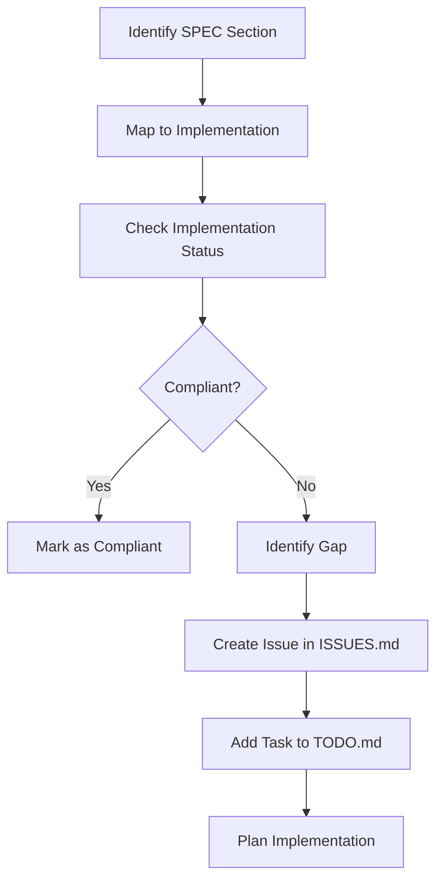

# CacheInfinity SPEC Compliance Analysis Plan

## Overview

This document establishes the framework for analyzing and ensuring CacheInfinity's compliance with its specification (`SPEC.md`). It provides a systematic approach to identify gaps, track progress, and maintain ongoing compliance as the project evolves.

## Analysis Framework

### 1. Compliance Categories

Based on the current TODO.md structure, compliance is organized into four main phases:

#### Phase 1: Critical Compliance (High Priority) ✅ COMPLETED
- **Status**: 100% Complete (12/12 tasks)
- **Focus**: Tracking setup, TLS, configuration management
- **Key Components**:
  - ISSUES.md tracking system
  - TLS implementation (HTTP-01, DNS-01 challenge modes)
  - Configuration import/export functionality

#### Phase 2: Core Feature Completion (Medium Priority)
- **Status**: 33% Complete (4/12 tasks)
- **Focus**: FTP/FTPS/SFTP support, zip caching completion
- **Critical Gaps**:
  - SFTP virtual `.ssh/authorized_keys` management (SPEC 6.3)
  - Zip caching size limits and one-zip-at-a-time locking
  - SFTP permission mapping and admin interfaces

#### Phase 3: Testing and Robustness (Medium Priority)
- **Status**: 0% Complete (0/18 tasks)
- **Focus**: Comprehensive testing, indexing improvements
- **Critical Requirements**:
  - pytest framework setup
  - SPEC compliance validation tests
  - Integration testing for major workflows

#### Phase 4: Documentation and Maintenance (Ongoing)
- **Status**: 0% Complete (0/10 tasks)
- **Focus**: Documentation updates, compliance monitoring
- **Requirements**:
  - Updated README.md and user guides
  - Compliance monitoring process establishment

### 2. Compliance Analysis Methodology

#### 2.1 Specification Review Process

#### 2.2 Gap Analysis Framework

For each SPEC requirement:

1. **Requirement Identification**: Extract specific requirement from SPEC.md
2. **Implementation Mapping**: Locate corresponding code implementation
3. **Compliance Verification**: Validate implementation against specification
4. **Gap Documentation**: Record any discrepancies or missing functionality
5. **Priority Assignment**: Assign priority based on impact and dependencies

### 3. Current Compliance Status

#### 3.1 Overall Statistics
- **Total Compliance Tasks**: 20
- **Completed Tasks**: 12 (60%)
- **Remaining Tasks**: 8 (40%)
- **High Priority Tasks**: 7 (35%)
- **Medium Priority Tasks**: 10 (50%)
- **Low Priority Tasks**: 3 (15%)

#### 3.2 Critical Compliance Gaps

**1. SFTP Virtual `.ssh/authorized_keys` Management (SPEC 6.3)**
- **Status**: ❌ NOT IMPLEMENTED
- **Impact**: High - Missing core SFTP functionality
- **Tasks**: TASK-034 to TASK-041 (8 tasks)
- **Dependencies**: SFTP protocol handler implementation

**2. Zip Caching Completion**
- **Status**: ❌ PARTIALLY IMPLEMENTED
- **Impact**: Medium - Affects user experience with archive files
- **Tasks**: TASK-040 to TASK-046 (7 tasks)
- **Dependencies**: VFS layer integration

**3. Comprehensive Testing Framework**
- **Status**: ❌ NOT IMPLEMENTED
- **Impact**: Critical - Affects project reliability
- **Tasks**: TASK-050 to TASK-055 (6 tasks)
- **Dependencies**: None (can be implemented independently)

### 4. Compliance Analysis Tools

#### 4.1 Specification Cross-Reference Matrix

| SPEC Section | Implementation | Status | Priority | Notes |
|--------------|----------------|--------|----------|-------|
| 2.1 Two-Port Architecture | `app/hosting/dispatcher.py` | ✅ Complete | High | ✅ |
| 2.2 Hosting Port Components | Various modules | ✅ Complete | High | ✅ |
| 4.1 VFS Architecture | `app/storage/vfs.py` | ✅ Complete | High | ✅ |
| 5.1 Share Schema | Database schema | ✅ Complete | High | ✅ |
| 6.1 FTP/FTPS Implementation | `app/hosting/ftp.py` | ✅ Complete | Medium | ✅ |
| 6.2 SFTP Implementation | Partial | 🟡 Partial | High | Missing authorized_keys |
| 6.3 Virtual authorized_keys | Not implemented | ❌ Missing | High | Critical gap |
| 12.1 Zip Caching Policy | Partial | 🟡 Partial | Medium | Size limits missing |
| 16.1 Admin WebUI | `app/ui/web/*` | ✅ Complete | Medium | ✅ |
| 16.2 Admin API | `app/ui/api.py` | ✅ Complete | Medium | ✅ |

#### 4.2 Compliance Validation Checklist

For each SPEC requirement, verify:

- [ ] **Implementation Exists**: Code implements the requirement
- [ ] **Specification Alignment**: Implementation matches SPEC exactly
- [ ] **Test Coverage**: Requirement has appropriate tests
- [ ] **Documentation**: Feature is documented in README.md
- [ ] **Integration**: Feature works with related components

### 5. Implementation Strategy

#### 5.1 Phase 2 Completion (Next 2-3 Weeks)

**Priority 1: SFTP Virtual authorized_keys (TASK-034 to TASK-041)**
- Implement virtual `.ssh/authorized_keys` management
- Add database storage for SSH keys
- Integrate with authentication system
- **Estimated Effort**: 2-3 weeks

**Priority 2: Zip Caching Completion (TASK-040 to TASK-046)**
- Implement size limit validation
- Add one-zip-at-a-time locking
- Complete whole-zip vs individual-file logic
- **Estimated Effort**: 1-2 weeks

#### 5.2 Phase 3 Testing Framework (Week 4-6)

**Priority 1: pytest Setup (TASK-050 to TASK-055)**
- Set up testing framework
- Create unit tests for core components
- Implement SPEC compliance validation tests
- **Estimated Effort**: 2-3 weeks

**Priority 2: Integration Testing**
- Test major workflows
- Validate SPEC compliance automatically
- Set up continuous integration
- **Estimated Effort**: 1-2 weeks

#### 5.3 Phase 4 Documentation (Ongoing)

**Priority 1: Documentation Updates (TASK-100 to TASK-104)**
- Update README.md with current status
- Document all implemented features
- Create user guide for new features
- **Estimated Effort**: 1 week

**Priority 2: Compliance Monitoring (TASK-110 to TASK-114)**
- Establish compliance monitoring process
- Create compliance checklist
- Implement automated compliance checks
- **Estimated Effort**: 1 week

### 6. Risk Assessment

#### 6.1 High Risk Areas

**SFTP Virtual authorized_keys Management**
- **Risk**: Missing core SFTP functionality affects protocol completeness
- **Mitigation**: Prioritize implementation in next sprint
- **Impact**: High - Users cannot use SFTP for SSH key authentication

**Testing Framework Absence**
- **Risk**: No automated validation of SPEC compliance
- **Mitigation**: Implement pytest framework immediately
- **Impact**: Critical - Cannot ensure ongoing compliance

#### 6.2 Medium Risk Areas

**Zip Caching Incomplete**
- **Risk**: Poor user experience with large archive files
- **Mitigation**: Complete implementation in parallel with SFTP
- **Impact**: Medium - Affects specific use cases

**Documentation Gaps**
- **Risk**: Users cannot understand or use implemented features
- **Mitigation**: Update documentation alongside implementation
- **Impact**: Medium - Affects user adoption

### 7. Success Metrics

#### 7.1 Compliance Targets

- **Phase 1**: 100% Complete ✅ (ACHIEVED)
- **Phase 2**: 100% Complete (Target: 6 weeks)
- **Phase 3**: 100% Complete (Target: 10 weeks)
- **Phase 4**: 100% Complete (Target: 12 weeks)

#### 7.2 Quality Metrics

- **Test Coverage**: >80% for all new features
- **SPEC Alignment**: 100% compliance for implemented features
- **Documentation**: All features documented in README.md
- **Performance**: No degradation in existing functionality

### 8. Ongoing Compliance Process

#### 8.1 Regular Reviews

- **Weekly**: Review TODO.md progress
- **Bi-weekly**: Update compliance matrix
- **Monthly**: Comprehensive SPEC alignment review
- **Quarterly**: Full compliance audit

#### 8.2 Change Management

1. **New Requirements**: Add to TODO.md with priority
2. **Specification Changes**: Update SPEC.md first, then implementation
3. **Implementation Changes**: Validate against SPEC.md before merging
4. **Bug Fixes**: Ensure fixes maintain SPEC compliance

#### 8.3 Continuous Monitoring

- Automated SPEC compliance tests in CI/CD
- Regular documentation reviews
- User feedback integration
- Performance monitoring

### 9. Conclusion

This compliance analysis provides a structured approach to achieving and maintaining SPEC compliance for CacheInfinity. The current 60% completion rate shows significant progress, with critical gaps identified and prioritized for implementation.

**Immediate Next Steps:**
1. Complete SFTP virtual authorized_keys implementation
2. Set up comprehensive testing framework
3. Implement zip caching completion
4. Establish ongoing compliance monitoring process

By following this plan, CacheInfinity can achieve full SPEC compliance while maintaining code quality and user experience standards.