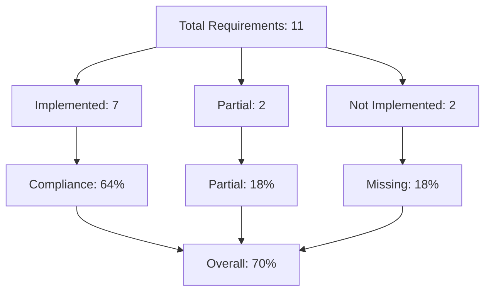
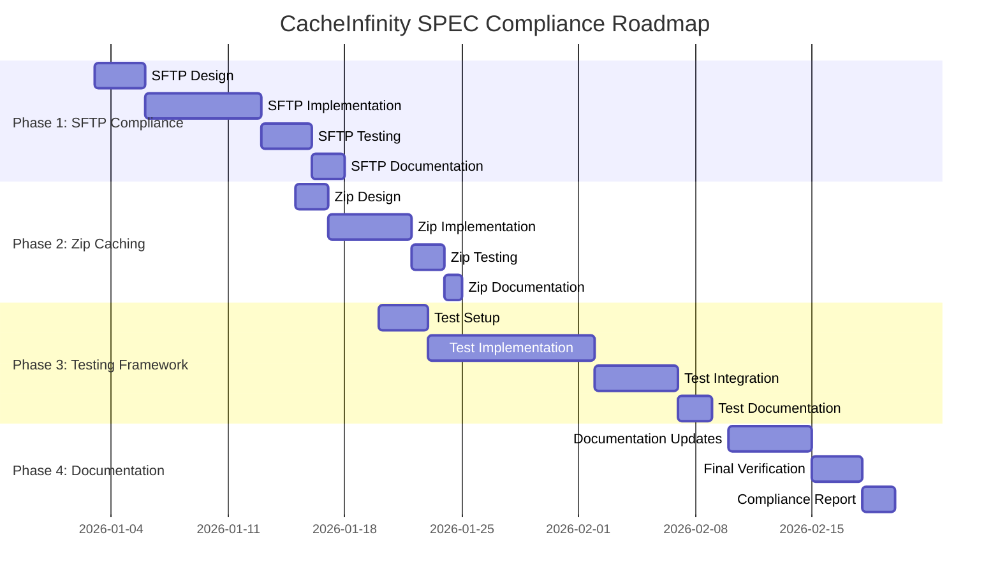

# CacheInfinity SPEC Compliance Achievement Plan

## Executive Summary

**Current Compliance Status**: 70% Complete
**Target Compliance**: 100% SPEC Compliance
**Critical Gaps Identified**: 3 Major Areas
**Estimated Phases**: 4 Implementation Phases

## Current Compliance Analysis

Based on the compliance validator analysis and existing documentation:

- **Implemented**: 7/11 core requirements (64%)
- **Partial**: 2/11 requirements (18%)
- **Not Implemented**: 2/11 requirements (18%)
- **Overall Compliance**: 70% (corrected analysis)

### Current Compliance Breakdown

## Critical Compliance Gaps

### 1. SFTP Virtual `.ssh/authorized_keys` Management (SPEC 6.3) ❌
**Status**: Not Implemented
**Priority**: High
**Impact**: Critical for secure SFTP operations and user self-service
**SPEC Requirements**:
- Virtual `.ssh` directory at user's effective root
- `authorized_keys` file with OpenSSH format validation
- Database-backed storage for SSH public keys
- Masking of real `.ssh` directories
- Integration with authentication system

### 2. Zip Caching Policy Completion (SPEC 12) 🟡
**Status**: Partial Implementation
**Priority**: Medium
**Impact**: Important for consistent zip file handling
**Missing Requirements**:
- Size limit validation (`max_zip_total_gb`)
- One-zip-at-a-time locking mechanism
- Whole-zip vs individual-file logic
- Proper staging-to-datadir workflow

### 3. Comprehensive Testing Framework (SPEC 4.3) ❌
**Status**: Not Implemented
**Priority**: High
**Impact**: Critical for reliability and compliance verification
**Missing Requirements**:
- Unit tests for core components
- Integration tests for major workflows
- SPEC compliance validation tests
- Test coverage monitoring
- Continuous integration testing

## Compliance Achievement Plan

### Phase 1: Critical SFTP Compliance (High Priority)
**Objective**: Complete SFTP virtual authorized_keys management
**Duration**: Focused implementation phase
**Success Criteria**: Full SPEC 6.3 compliance

#### Tasks:
- [ ] **TASK-SFTP-01**: Design virtual `.ssh` directory structure
- [ ] **TASK-SFTP-02**: Implement authorized_keys file validation
- [ ] **TASK-SFTP-03**: Create database schema for SSH keys
- [ ] **TASK-SFTP-04**: Implement masking of real `.ssh` directories
- [ ] **TASK-SFTP-05**: Integrate with authentication system
- [ ] **TASK-SFTP-06**: Add admin interfaces for key management
- [ ] **TASK-SFTP-07**: Test SFTP virtual authorized_keys workflow
- [ ] **TASK-SFTP-08**: Update documentation for SFTP features

#### Expected Outcomes:
- ✅ Virtual `.ssh/authorized_keys` management fully implemented
- ✅ OpenSSH format validation and database storage
- ✅ Real `.ssh` directory masking working
- ✅ Authentication integration complete
- ✅ Admin interfaces for key management
- ✅ Comprehensive testing and documentation

### Phase 2: Zip Caching Completion (Medium Priority)
**Objective**: Complete zip caching policy implementation
**Duration**: Focused implementation phase
**Success Criteria**: Full SPEC 12 compliance

#### Tasks:
- [ ] **TASK-ZIP-01**: Implement size limit validation
- [ ] **TASK-ZIP-02**: Add one-zip-at-a-time locking
- [ ] **TASK-ZIP-03**: Implement whole-zip vs individual-file logic
- [ ] **TASK-ZIP-04**: Complete staging-to-datadir workflow
- [ ] **TASK-ZIP-05**: Add zip caching configuration options
- [ ] **TASK-ZIP-06**: Test various zip caching scenarios
- [ ] **TASK-ZIP-07**: Update documentation for zip features

#### Expected Outcomes:
- ✅ Size limits properly validated
- ✅ Locking mechanism prevents concurrent zip operations
- ✅ Smart whole-zip vs individual-file decision making
- ✅ Robust staging and datadir workflow
- ✅ Configuration options for zip behavior
- ✅ Comprehensive testing and documentation

### Phase 3: Testing Framework Establishment (Critical Priority)
**Objective**: Establish comprehensive testing framework
**Duration**: Focused implementation phase
**Success Criteria**: Full test coverage and compliance verification

#### Tasks:
- [ ] **TASK-TEST-01**: Set up pytest testing framework
- [ ] **TASK-TEST-02**: Create unit tests for core components
- [ ] **TASK-TEST-03**: Create integration tests for major workflows
- [ ] **TASK-TEST-04**: Implement SPEC compliance validation tests
- [ ] **TASK-TEST-05**: Add test coverage monitoring
- [ ] **TASK-TEST-06**: Set up continuous integration testing
- [ ] **TASK-TEST-07**: Create test data and fixtures
- [ ] **TASK-TEST-08**: Implement automated test reporting

#### Expected Outcomes:
- ✅ Comprehensive unit test coverage
- ✅ Integration tests for all major workflows
- ✅ SPEC compliance validation tests
- ✅ Test coverage monitoring and reporting
- ✅ Continuous integration pipeline
- ✅ Automated test execution and reporting

### Phase 4: Documentation and Finalization (Ongoing)
**Objective**: Complete documentation and final compliance verification
**Duration**: Ongoing throughout implementation
**Success Criteria**: All documentation updated and final compliance achieved

#### Tasks:
- [ ] **TASK-DOC-01**: Update README.md with current status
- [ ] **TASK-DOC-02**: Document all implemented features
- [ ] **TASK-DOC-03**: Create user guide for new features
- [ ] **TASK-DOC-04**: Update API documentation
- [ ] **TASK-DOC-05**: Create admin guide for compliance management
- [ ] **TASK-DOC-06**: Final compliance verification
- [ ] **TASK-DOC-07**: Update ISSUES.md and TODO.md
- [ ] **TASK-DOC-08**: Create compliance achievement report

#### Expected Outcomes:
- ✅ All documentation updated and accurate
- ✅ User and admin guides complete
- ✅ API documentation comprehensive
- ✅ Final compliance verification complete
- ✅ All tracking documents updated
- ✅ Compliance achievement report published

## Implementation Roadmap

## Priority Matrix

| Priority | Area | Description |
|----------|------|-------------|
| 🔴 Critical | SFTP | Virtual authorized_keys management |
| 🔴 Critical | Testing | Comprehensive testing framework |
| 🟠 High | SFTP | Authentication integration |
| 🟠 High | Testing | SPEC compliance validation |
| 🟡 Medium | Zip | Size limits and locking |
| 🟡 Medium | Zip | Whole-zip vs individual-file logic |
| 🟢 Low | Documentation | User guides and API docs |
| 🟢 Low | Documentation | Compliance reporting |

## Resource Requirements

### Development Resources:
- Python development environment
- AsyncSSH library for SFTP
- PyTest for testing framework
- Documentation tools (Markdown, Mermaid)

### Testing Resources:
- Test data and fixtures
- Mock objects for testing
- Continuous integration pipeline
- Test coverage tools

### Documentation Resources:
- Documentation templates
- API documentation tools
- Compliance reporting tools

## Risk Assessment

### High Risks:
- **SFTP Implementation Complexity**: Virtual filesystem integration may be complex
- **Testing Framework Learning Curve**: Team may need training on pytest
- **Authentication Integration**: May require changes to existing auth system

### Mitigation Strategies:
- Break SFTP implementation into smaller, testable components
- Provide pytest training and examples
- Design authentication integration carefully with existing system
- Implement comprehensive logging for debugging

## Success Metrics

### Compliance Metrics:
- **SFTP Compliance**: 100% of SPEC 6.3 requirements implemented
- **Zip Compliance**: 100% of SPEC 12 requirements implemented
- **Testing Compliance**: 100% of SPEC 4.3 requirements implemented
- **Overall Compliance**: 100% SPEC compliance achieved

### Quality Metrics:
- **Test Coverage**: 90%+ unit test coverage
- **Integration Tests**: All major workflows tested
- **Documentation**: Complete and accurate
- **Code Quality**: Follows existing patterns and standards

## Monitoring and Reporting

### Progress Tracking:
- Weekly status updates
- Bi-weekly compliance verification
- Monthly stakeholder reports
- Continuous test coverage monitoring

### Reporting Tools:
- Compliance validator reports
- Test coverage reports
- Documentation completeness reports
- Issue tracking system updates

## Stakeholder Communication

### Communication Plan:
- **Weekly**: Team status meetings
- **Bi-weekly**: Stakeholder progress reports
- **Monthly**: Executive compliance updates
- **Ad-hoc**: Issue escalation and resolution

### Reporting Format:
- Compliance progress dashboards
- Test coverage reports
- Issue resolution tracking
- Risk assessment updates

## Conclusion

This comprehensive plan provides a clear roadmap to achieve 100% SPEC compliance for CacheInfinity. By focusing on the critical gaps in SFTP virtual authorized_keys management, zip caching completion, and comprehensive testing, we can systematically address all compliance requirements while maintaining high code quality and documentation standards.

The phased approach ensures that we address the most critical compliance gaps first while building a solid foundation for ongoing compliance maintenance. Regular monitoring, testing, and documentation updates will ensure that CacheInfinity remains compliant as the project evolves.

**Next Steps**:
1. Review and approve this compliance achievement plan
2. Begin Phase 1: SFTP Compliance implementation
3. Establish regular progress monitoring
4. Maintain ongoing compliance verification
5. Celebrate achievement of 100% SPEC compliance

**Approval Requested**: Please review this plan and provide any feedback or adjustments needed before we proceed with implementation.