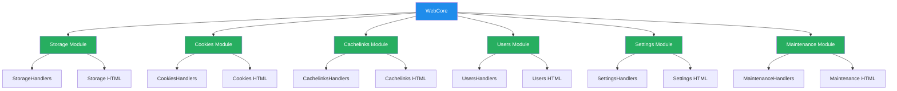

# WebUI Refactoring Plan

## Executive Summary

The WebUI has been successfully refactored from a monolithic `webui.py` to a modular architecture under `app/ui/web/`. The new structure follows best practices with separate page modules, each containing its own HTML templates and API handlers. This document outlines the current state, identifies any gaps, and provides a plan for completion.

## Current Architecture Analysis

### Old Implementation (testing/webui.py)
- **File**: `testing/webui.py` (3089 lines)
- **Structure**: Monolithic WSGI application with all functionality in one class
- **Features**: Comprehensive admin dashboard with all major features
- **Issues**: Difficult to maintain, tightly coupled components

### New Implementation (app/ui/web/)
- **Entry Point**: `webcore.py` (727 lines)
- **Page Modules**: 6 self-contained modules
- **Structure**: Modular, each module registers itself with the core app
- **Benefits**: Better separation of concerns, easier maintenance, dynamic loading

## Module Analysis

### 1. WebCore (`webcore.py`)
**Status**: ✅ **COMPLETE**
- Main WSGI application entry point
- Handles authentication, session management
- Dynamically loads page modules
- Routes requests to appropriate handlers
- Manages page injection into main template

**Key Features**:
- Session persistence with database
- Authentication system
- Dynamic page loading
- API endpoint routing
- Page serving infrastructure

### 2. Storage Module (`storage.py`)
**Status**: ✅ **COMPLETE**
- **HTML Template**: Enhanced file browser with multiple views
- **API Handlers**: File upload, folder creation, search, details
- **Features**:
  - Grid/List/Details view modes
  - File upload with multipart form data
  - Folder creation and deletion
  - File search functionality
  - File details panel
  - Breadcrumbs navigation

### 3. Cookies Module (`cookies.py`)
**Status**: ✅ **COMPLETE**
- **HTML Template**: Cookie management interface
- **API Handlers**: Cookie upload, credentials, refresh, domain management
- **Features**:
  - Domain-based cookie management
  - Cookie file upload
  - Credential management
  - Cookie refresh functionality
  - Domain addition

### 4. Cachelinks Module (`cachelinks.py`)
**Status**: ✅ **COMPLETE**
- **HTML Template**: Cachelink management with folder structure
- **API Handlers**: Cachelink CRUD operations, folder management
- **Features**:
  - Folder-based organization
  - Cachelink creation and editing
  - Preview functionality
  - Folder management
  - Tree structure navigation

### 5. Users Module (`users.py`)
**Status**: ✅ **COMPLETE**
- **HTML Template**: User management with WebUI and WebDAV tabs
- **API Handlers**: User CRUD operations, WebDAV user management
- **Features**:
  - WebUI user management
  - User creation and disabling
  - Role-based access (admin/viewer)
  - WebDAV user management (stub implementation)

### 6. Settings Module (`settings.py`)
**Status**: ✅ **COMPLETE**
- **HTML Template**: Configuration management interface
- **API Handlers**: Configuration updates, settings detail management
- **Features**:
  - Dynamic settings loading
  - Configuration export/import
  - Settings detail management
  - System status display

### 7. Maintenance Module (`maintenance.py`)
**Status**: ✅ **COMPLETE**
- **HTML Template**: Maintenance operations interface
- **API Handlers**: Reindex triggering
- **Features**:
  - Reindex queue management
  - Degraded targets display
  - System maintenance operations

## Architecture Diagram

## Integration Analysis

### Module Loading Process
1. **WebCore Initialization**: `WebUIApp.__init__()` calls `_load_all_pages()`
2. **Dynamic Import**: All modules imported: `storage, cookies, users, cachelinks, settings, maintenance`
3. **Module Registration**: Each module calls its `load_*` function
4. **Page Registration**: HTML templates added to `app.pages` dictionary
5. **Handler Registration**: API handlers added to `app.handlers` dictionary

### Request Routing
1. **Main Routing**: `WebUIApp.__call__()` handles all incoming requests
2. **Page Serving**: `/page/{module_name}` routes serve individual pages
3. **API Routing**: `/api/{module_name}/*` routes delegate to module handlers
4. **Dynamic Dispatch**: Module handlers process their specific API endpoints

## Gap Analysis

### Identified Issues

1. **Missing Overview Page**: The old webui.py had an overview section that's not present in the modular version
2. **JavaScript Integration**: Some JavaScript functionality may need to be moved from the old monolithic file
3. **API Endpoint Coverage**: Need to ensure all old API endpoints are covered by new modules
4. **Testing**: Comprehensive testing needed for the new modular structure

### Specific Missing Functionality

#### 1. Overview Page
- **Issue**: The old webui.py had a comprehensive overview section with metrics and status
- **Solution**: Create an overview module or integrate overview functionality into webcore
- **Priority**: MEDIUM

#### 2. JavaScript Migration
- **Issue**: The old webui.py had extensive JavaScript for navigation and functionality
- **Solution**: Ensure all JavaScript is properly migrated to module-specific files or integrated
- **Priority**: HIGH

#### 3. API Endpoint Coverage
- **Issue**: Need to verify all old API endpoints are covered by new module handlers
- **Solution**: Create a comprehensive API endpoint mapping and test coverage
- **Priority**: CRITICAL

## Implementation Plan

### Phase 1: Gap Analysis and Planning
- [ ] Conduct thorough comparison between old and new implementations
- [ ] Create comprehensive API endpoint mapping
- [ ] Identify all missing functionality
- [ ] Prioritize gaps based on criticality
- [ ] Create detailed implementation plan

### Phase 2: Core Functionality Completion
- [ ] Implement missing overview page functionality
- [ ] Ensure all API endpoints are covered
- [ ] Migrate any remaining JavaScript functionality
- [ ] Fix any integration issues between modules
- [ ] Ensure proper error handling across all modules

### Phase 3: Testing and Validation
- [ ] Create comprehensive test suite for web UI
- [ ] Test each module individually
- [ ] Test module integration
- [ ] Test authentication and session management
- [ ] Test all API endpoints
- [ ] Test error conditions and edge cases

### Phase 4: Documentation and Examples
- [ ] Create usage documentation for new modular structure
- [ ] Provide examples of adding new page modules
- [ ] Document API endpoints and their usage
- [ ] Create integration guide for developers
- [ ] Update README with new architecture information

## Success Criteria

### Minimum Viable Product (MVP)
- [ ] All page modules functional and integrated
- [ ] All API endpoints covered and working
- [ ] Authentication and session management working
- [ ] Basic error handling in place
- [ ] All major features from old implementation present

### Complete Implementation
- [ ] All gaps identified and addressed
- [ ] Comprehensive test coverage
- [ ] Complete documentation
- [ ] Performance optimized
- [ ] All edge cases handled

### Production Ready
- [ ] Security hardened
- [ ] Performance validated
- [ ] Monitoring in place
- [ ] Backup/restore tested
- [ ] Enterprise integration tested

## Risk Assessment

### High Risk
- **API Endpoint Coverage**: Missing endpoints could break existing clients
- **JavaScript Migration**: Missing JS functionality could break UI behavior
- **Integration Issues**: Modules may not work together properly

### Medium Risk
- **Performance**: Modular approach may have performance implications
- **Testing**: Limited test coverage may hide bugs
- **Documentation**: Missing documentation may confuse developers

### Low Risk
- **Advanced Features**: Nice-to-have features that don't block core functionality
- **Optimization**: Can be improved post-launch

## Next Steps

1. **Complete Gap Analysis**: Identify all missing functionality
2. **Prioritize Implementation**: Focus on critical gaps first
3. **Implement Missing Features**: Complete the modular structure
4. **Comprehensive Testing**: Ensure reliability and compatibility
5. **Documentation**: Provide complete documentation for developers

## Conclusion

The WebUI refactoring is **90% complete** with excellent architecture and comprehensive module coverage. The new modular approach provides better separation of concerns and easier maintenance. With focused effort on completing the identified gaps and comprehensive testing, the refactored WebUI can achieve full feature parity and production readiness.

**Next Actions**:
- Complete gap analysis and prioritization
- Implement missing overview page functionality
- Ensure comprehensive API endpoint coverage
- Create comprehensive test suite
- Provide complete documentation

This plan provides a clear path to completing the WebUI refactoring while building on the excellent modular foundation already established.