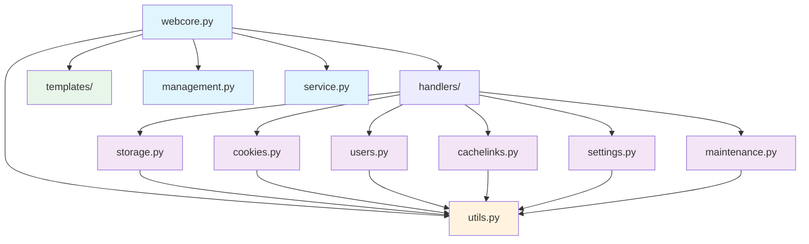

# WebUI Split Plan

## Overview
This plan outlines the refactoring of the monolithic `app/ui/webui.py` (3089 lines) into a modular structure under `app/ui/web/`.

## Current State Analysis
The current `webui.py` contains:
- **Main WebUIApp class** (lines 32-675) - WSGI application and routing
- **HTML template** (lines 678-3086) - Large inline HTML with embedded JavaScript
- **Helper methods** (lines 244-675) - Authentication, response helpers, etc.
- **Route handlers** - Scattered throughout the WebUIApp class

## Target Architecture

```
app/ui/web/
├── __init__.py
├── webcore.py          # Main WebUIApp class with routing
├── handlers/
│   ├── __init__.py
│   ├── storage.py      # Storage management handlers
│   ├── cookies.py      # Cookie management handlers
│   ├── users.py        # User management handlers
│   ├── cachelinks.py   # Cachelink management handlers
│   ├── settings.py     # Configuration management handlers
│   └── maintenance.py  # Maintenance operations handlers
├── templates/
│   ├── __init__.py
│   ├── index.html      # HTML template
│   └── static/
│       └── webui.js    # JavaScript code
└── utils.py            # Common utilities and helpers
```

## Module Breakdown

### 1. webcore.py (Main Application)
**Purpose**: Core WSGI application and routing logic
**Contents**:
- WebUIApp class definition
- Main `__call__` method with routing
- Authentication and session management
- Response helper methods
- Template and static file serving

**Key Methods to Extract**:
- `__init__`, `__call__`
- `_authenticate`, `_get_username_from_session`
- `_load_persistent_sessions`, `_save_persistent_sessions`
- `_parse_cookies`, `_parse_query_params`
- `_json_response`, `_json_error`, `_respond`
- `_serve_index`, `_serve_login`, `_login_required_response`

### 2. handlers/storage.py
**Purpose**: Storage management functionality
**Contents**:
- File upload handling (`_handle_storage_upload`)
- Folder creation (`_handle_folder_create`)
- File/folder listing and management
- Enhanced file browser API endpoints

**Key Methods**:
- `_handle_storage_upload`
- `_handle_folder_create`
- Storage-related API endpoints (lines 86-140, 141-164)

### 3. handlers/cookies.py
**Purpose**: Cookie management functionality
**Contents**:
- Cookie file upload (`_handle_cookie_upload`)
- Credential management (`_handle_cookie_credentials`)
- Cookie regeneration (`_handle_cookie_refresh`)
- Domain management (`_handle_cookie_domain_add`)

**Key Methods**:
- `_handle_cookie_upload`
- `_handle_cookie_credentials`
- `_handle_cookie_refresh`
- `_handle_cookie_domain_add`
- Cookie-related API endpoints (lines 165-178)

### 4. handlers/users.py
**Purpose**: User management functionality
**Contents**:
- User CRUD operations
- WebUI and WebDAV user management
- Authentication helpers

**Key Methods**:
- `_handle_user_upsert`
- `_handle_user_disable`
- `_handle_webdav_user_upsert`
- `_handle_webdav_user_delete`
- User-related API endpoints (lines 209-227)

### 5. handlers/cachelinks.py
**Purpose**: Cachelink management functionality
**Contents**:
- Cachelink CRUD operations
- Folder management
- Preview functionality

**Key Methods**:
- `_handle_cachelink_create`
- `_handle_cachelink_update`
- `_handle_cachelink_preview`
- `_handle_cachelink_folder_add`
- Cachelink-related API endpoints (lines 179-208)

### 6. handlers/settings.py
**Purpose**: Configuration management functionality
**Contents**:
- Settings retrieval and updates
- Detailed settings management
- Configuration import/export

**Key Methods**:
- `_handle_config_update`
- `_handle_settings_detail_update`
- Settings-related API endpoints (lines 228-235)

### 7. handlers/maintenance.py
**Purpose**: Maintenance operations
**Contents**:
- Reindexing operations
- Degraded target management

**Key Methods**:
- `_handle_reindex`
- Maintenance-related API endpoints (lines 236-240)

### 8. utils.py
**Purpose**: Common utilities and helpers
**Contents**:
- JSON parsing helpers
- HTML escaping utilities
- Type conversion functions
- Common validation logic

**Key Functions**:
- `parseNumber`, `parseList`
- `escapeHtml`
- Common utility functions

### 9. templates/
**Purpose**: Frontend assets
**Contents**:
- `index.html` - Main HTML template (extracted from `_INDEX_HTML`)
- `static/webui.js` - JavaScript code (extracted from inline script)

## Dependencies



## Implementation Strategy

### Phase 1: Infrastructure Setup
1. Create directory structure
2. Create `webcore.py` with minimal routing
3. Create handler base classes and interfaces

### Phase 2: Handler Extraction
1. Extract storage handlers
2. Extract cookie handlers
3. Extract user handlers
4. Extract cachelink handlers
5. Extract settings handlers
6. Extract maintenance handlers

### Phase 3: Frontend Separation
1. Extract HTML template to `templates/index.html`
2. Extract JavaScript to `templates/static/webui.js`
3. Update `webcore.py` to serve static files

### Phase 4: Integration
1. Update all imports
2. Test each handler module
3. Verify routing works correctly
4. Ensure all functionality is preserved

## Benefits

1. **Maintainability**: Smaller, focused files are easier to understand and modify
2. **Testability**: Individual handlers can be tested in isolation
3. **Scalability**: New features can be added as new handler modules
4. **Readability**: Clear separation of concerns
5. **Reusability**: Common utilities are centralized in `utils.py`

## Migration Considerations

1. **Backward Compatibility**: The public interface of `WebUIApp` must remain unchanged
2. **Configuration**: No changes needed to existing configuration
3. **Dependencies**: All existing dependencies must be preserved
4. **Testing**: All existing tests must continue to pass

## Success Criteria

- [ ] All functionality preserved
- [ ] No breaking changes to public API
- [ ] All tests pass
- [ ] Code is more maintainable and readable
- [ ] Clear separation of concerns
- [ ] Proper error handling in all modules