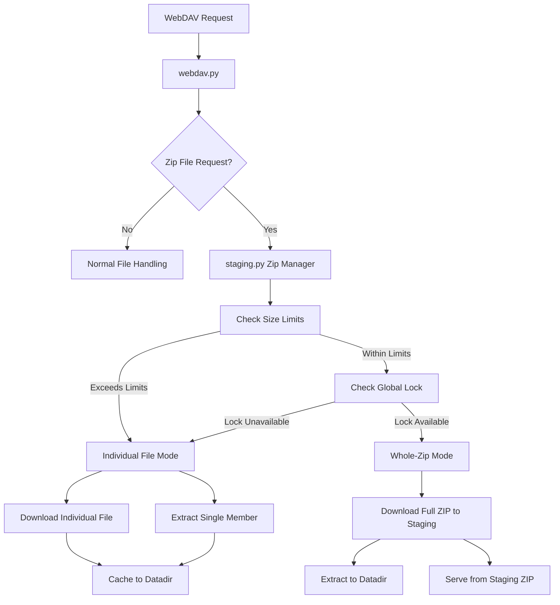

# Zip Caching Implementation Plan

## Overview
This plan outlines the implementation of the zip caching algorithm for CacheInfinity, moving the logic from `webdav.py` to `staging.py` where it belongs, since it's related to staging area management and capacity constraints.

## Current State Analysis

### Current Implementation in webdav.py
The current implementation in `CachelinkFileResource._handle_zip_download()` (lines 939-1066) includes:
- Basic zip file download and extraction
- Size limit checking using `max_zip_total_gb`
- One-zip-at-a-time locking mechanism
- Whole-zip vs individual-file logic
- Zip file extraction to datadir

### Issues with Current Implementation
1. **Wrong Location**: Zip caching logic belongs in staging.py, not webdav.py
2. **Incomplete SPEC Compliance**: Missing proper validation and error handling
3. **Tight Coupling**: WebDAV layer shouldn't handle staging area management
4. **Limited Functionality**: Basic implementation needs enhancement per SPEC requirements

## SPEC Requirements (Section 12)

### 12.1 Size Limits
- `max_zip_total_gb` applies to both ZIP compressed size and uncompressed size
- Whole-zip caching only allowed when within limits
- Must validate both compressed and uncompressed sizes

### 12.2 One-Zip-at-a-Time Rule
- Global lock when `one_zip_cache_at_a_time: true`
- If lock held: ignore size checks, serve/cache requested file individually
- Prevents multiple large zip operations from overwhelming system

### 12.3 Whole-Zip Allowed Flow
- Download ZIP to staging
- Serve requested file directly from staging ZIP
- Extract ZIP (or configured prefix) into datadir destination

### 12.4 Individual-File Mode
- Fetch just requested file's bytes
- Extract just that member from locally staged ZIP
- Write single file into datadir if capacity allows

## Architecture Design

### New Architecture Diagram



### Component Responsibilities

#### staging.py (New ZipCacheManager)
- **Size Validation**: Check compressed/uncompressed sizes against limits
- **Lock Management**: Global one-zip-at-a-time locking
- **Zip Operations**: Download, extract, manage zip files
- **Staging Management**: Handle staging area constraints
- **Fallback Logic**: Individual file mode when needed

#### webdav.py (Simplified)
- **Request Routing**: Detect zip file requests
- **Delegation**: Call staging.py for zip operations
- **Result Handling**: Serve content from staging or datadir
- **Error Handling**: Graceful fallback and user feedback

#### config.py (Enhanced)
- **Configuration**: Zip caching parameters
- **Validation**: Ensure sensible defaults and limits
- **Integration**: Make settings available to staging layer

## Implementation Plan

### Phase 1: Preparation and Analysis
1. **Remove current zip implementation from webdav.py**
   - Identify and extract zip-related code
   - Create backup of existing functionality
   - Update imports and dependencies

2. **Analyze SPEC requirements in detail**
   - Review section 12.1-12.4 thoroughly
   - Identify gaps in current implementation
   - Document compliance requirements

### Phase 2: Core Implementation

3. **Design ZipCacheManager in staging.py**
   - Create new class `ZipCacheManager`
   - Define interface and methods
   - Plan integration with existing staging logic

4. **Implement size limit validation**
   - Add `validate_zip_size()` method
   - Check both compressed and uncompressed sizes
   - Handle edge cases and error conditions

5. **Add one-zip-at-a-time locking**
   - Implement global lock mechanism
   - Add lock acquisition/release logic
   - Handle lock contention gracefully

6. **Implement whole-zip vs individual-file logic**
   - Create decision tree for mode selection
   - Implement whole-zip download and extraction
   - Implement individual file extraction
   - Add fallback mechanisms

### Phase 3: Integration and Configuration

7. **Add zip caching configuration options**
   - Extend `LimitsDefinition` in config.py
   - Add validation for zip parameters
   - Ensure backward compatibility

8. **Update webdav.py to use new staging-based zip caching**
   - Replace removed zip logic with staging calls
   - Handle delegation and result processing
   - Maintain existing API compatibility

### Phase 4: Testing and Documentation

9. **Test zip caching scenarios**
   - Create comprehensive test cases
   - Test size limit enforcement
   - Test locking mechanism
   - Test both whole-zip and individual modes
   - Test error conditions and fallbacks

10. **Update documentation**
    - Document new staging.py functionality
    - Update SPEC compliance notes
    - Add configuration examples
    - Create user-facing documentation

## Detailed Implementation Specifications

### ZipCacheManager Class (staging.py)

```python
class ZipCacheManager:
    def __init__(self, staging_area: StagingArea, limits: LimitsDefinition):
        self.staging_area = staging_area
        self.limits = limits
        self._global_lock = threading.Lock()
        self._active_zip_operations = 0
        
    def can_cache_whole_zip(self, zip_size: int, uncompressed_size: int) -> bool:
        """Check if whole-zip caching is allowed based on size limits."""
        max_bytes = self.limits.max_zip_total_gb * 1024**3
        return zip_size <= max_bytes and uncompressed_size <= max_bytes
    
    def acquire_zip_lock(self) -> bool:
        """Acquire global zip lock if one-zip-at-a-time is enabled."""
        if not self.limits.one_zip_cache_at_a_time:
            return True
        if self._global_lock.acquire(blocking=False):
            self._active_zip_operations += 1
            return True
        return False
    
    def release_zip_lock(self):
        """Release global zip lock."""
        if self._active_zip_operations > 0:
            self._active_zip_operations -= 1
            self._global_lock.release()
    
    def handle_zip_file(self, zip_url: str, destination: Path, 
                       member_path: str | None = None) -> Path | None:
        """Main zip handling method with automatic mode selection."""
        # Download zip to staging
        staging_zip = self._download_zip_to_staging(zip_url)
        if not staging_zip:
            return None
        
        # Check sizes and decide mode
        zip_size, uncompressed_size = self._get_zip_sizes(staging_zip)
        use_whole_zip = (self.can_cache_whole_zip(zip_size, uncompressed_size) and
                        self.acquire_zip_lock())
        
        if use_whole_zip:
            result = self._handle_whole_zip(staging_zip, destination)
            self.release_zip_lock()
            return result
        else:
            return self._handle_individual_file(staging_zip, destination, member_path)
```

### WebDAV Integration (webdav.py)

```python
# In CachelinkFileResource.get_content()
def get_content(self):
    # ... existing logic ...
    if self.descriptor.mode.value == "zip":
        # Use new staging-based zip caching
        zip_manager = self.service.staging.zip_cache_manager
        result_path = zip_manager.handle_zip_file(
            self._build_remote_url(),
            self.service.datadir_registry.primary.resolve(self.datadir_rel),
            self.subpath.name if self.subpath else None
        )
        if result_path and result_path.exists():
            self._record_access()
            return open(result_path, "rb")
        return None
```

### Configuration Enhancements (config.py)

```python
@dataclass
class ZipCacheDefinition:
    """Configuration for zip caching behavior."""
    
    # Maximum total size for zip operations (compressed and uncompressed)
    max_zip_total_gb: int = 100
    
    # Enable one-zip-at-a-time global locking
    one_zip_cache_at_a_time: bool = False
    
    # Timeout for zip operations
    zip_operation_timeout_seconds: int = 300
    
    # Maximum number of concurrent zip extractions
    max_concurrent_zip_operations: int = 1

# Integrate into existing SettingsDefinition
@dataclass
class SettingsDefinition:
    # ... existing fields ...
    zip_cache: ZipCacheDefinition = field(default_factory=ZipCacheDefinition)
```

## Testing Strategy

### Test Cases Required

1. **Size Limit Tests**
   - Test with zip files under limit
   - Test with zip files over compressed size limit
   - Test with zip files over uncompressed size limit
   - Test edge cases (exactly at limit)

2. **Locking Tests**
   - Test one-zip-at-a-time functionality
   - Test concurrent zip requests
   - Test lock acquisition/release
   - Test fallback to individual mode when locked

3. **Mode Selection Tests**
   - Test whole-zip mode selection
   - Test individual-file mode selection
   - Test automatic fallback logic
   - Test manual mode override

4. **Integration Tests**
   - Test WebDAV integration
   - Test staging area constraints
   - Test datadir caching
   - Test error handling and recovery

## Migration Plan

### From Current to New Implementation

1. **Backup**: Save current webdav.py implementation
2. **Extract**: Move zip logic to staging.py incrementally
3. **Test**: Verify each component works in isolation
4. **Integrate**: Connect new staging logic to webdav.py
5. **Validate**: Run comprehensive test suite
6. **Deploy**: Update production with new implementation

### Rollback Strategy

- Keep backup of original webdav.py
- Implement feature flags for gradual rollout
- Monitor performance and error rates
- Quick rollback capability if issues arise

## Compliance Verification

### SPEC Compliance Checklist

- [ ] 12.1 Size limits properly enforced
- [ ] 12.2 One-zip-at-a-time locking implemented
- [ ] 12.3 Whole-zip allowed flow working
- [ ] 12.4 Individual-file mode working
- [ ] Configuration options available
- [ ] Proper error handling and fallbacks
- [ ] Integration with existing caching pipeline

## Risks and Mitigations

### Potential Risks

1. **Performance Impact**: Zip operations could slow down requests
   - *Mitigation*: Implement async operations, add timeouts

2. **Staging Area Overflow**: Large zip files filling staging
   - *Mitigation*: Strict size limits, cleanup mechanisms

3. **Lock Contention**: Bottlenecks with one-zip-at-a-time
   - *Mitigation*: Configurable locking, fallback modes

4. **Memory Issues**: Large zip files consuming memory
   - *Mitigation*: Stream-based processing, chunked operations

### Monitoring Requirements

- Track zip operation success/failure rates
- Monitor staging area usage during zip operations
- Log lock contention and wait times
- Measure performance impact on WebDAV requests

## Future Enhancements

### Potential Improvements

1. **Parallel Extraction**: Multi-threaded zip extraction
2. **Partial Download**: Range requests for large zip files
3. **Cache Optimization**: Smart caching of frequently accessed members
4. **Progress Tracking**: Real-time progress for large zip operations

## Conclusion

This plan provides a comprehensive approach to implementing the zip caching algorithm according to SPEC requirements, with proper separation of concerns by moving the logic to staging.py. The implementation will be modular, testable, and compliant with all specified requirements while maintaining backward compatibility and system stability.